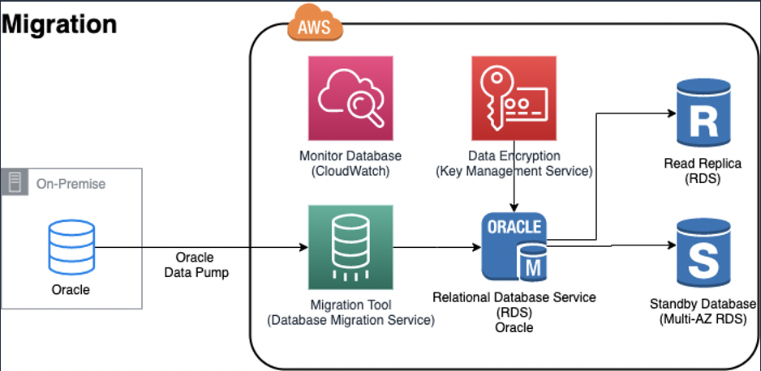
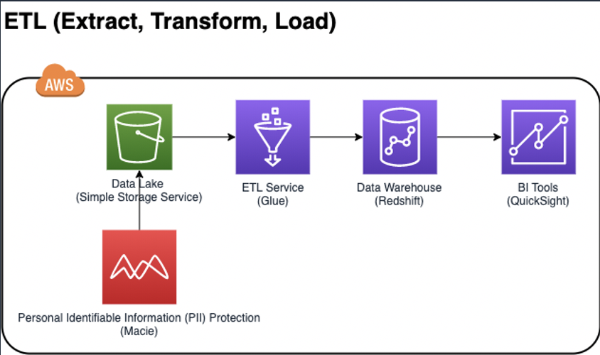

# Migration Database On AWS and Visualize data through QuickSight

### Architecture Diagram
#### Migration
    
#### Data Warehouse
    

### Agenda
* Migrate MySQL Database on EC2 Database to AWS RDS (Relational Database Service)
    * 1 - [Setup Networking on AWS](docs/Migration/SetupNetworking.md)
    * 2 - [Setup Your Database Server](docs/Migration/SetupEC2.md)
    * 3 - [Create RDS Database](docs/Migration/CreateRDS.md)
    * 4 - [Migrate the Database](docs/Migration/MigrateDB.md)
* Offload RDS Database to Data Lake and Data Warehouse
    * 1 - [Create and Integrate RDS to Data Lake (S3)](docs/DLAndDWH/IntegrateRDStoDataLake.md)
    * 2 - [Catalog the data in data lake](docs/DLAndDWH/DataCatalog.md)
    * 3 - [Create Data Warehouse (Redshift)](docs/DLAndDWH/DWH.md)
    * 4 - [ETL (Extract, Transform, Load) from Data Lake to Data Warehouse](docs/DLAndDWH/ETL.md)
* Visualize data from Data Warehouse using BI tools
    * 1 - [Visual Data from Data Warehouse using BI Tools (QuickSight)](docs/Visualization/Visualize.md)

### Scope of Project
* Migration will be done from EC2 MySQL to RDS MySQL
* All services will be on region us-east-1 (North Virginia)
* The instruction is for Mac User. Please use PuTTY to connect to terminal if you are using Windows.