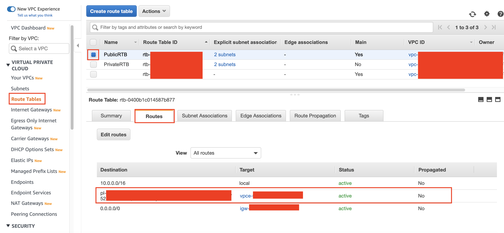

## Create Database Connection

To integrate Database service (RDS) to Data Lake (S3), we need to create a database connection. There are some requirements needed to create a connection. First, we need to create S3 Endpoint to access the data lake by using AWS connection instead of using public internet.

1. Go to [AWS Console](https://console.aws.amazon.com/console/home?region=us-east-1#)
2. Type `VPC` and click the VPC menu
    
3. click `endpoints` at the left menu
4. click `Create endpoint`
    
5. in filter textbox, type `S3` and click enter. then, choose the gateway displayed
6. choose your VPC (`DatabaseVPC`)
7. save the prefix list number (start with pl-xxxxxx). you will need it for later use
    
8. choose all route table displayed
    
9. at the bottom page, click `Create Endpoint`
10. at the endpoint page, hover your cursor to the endpoint name, and click the pencil icon
11. Type the name as `DatabaseVPCS3EP` and click the check icon.
    

You need to wait for around 2 minutes to set the endpoint.

After that, we need to check if the route tables that has been chosen are also going to be updated and refer to this endpoint that we have created.

12. click `Route tables` at the left menu
13. click the box at the left side of `PublicRTB` Route table
14. click `Routes` tab
    

in previous step, you have copied the prefix list number (start with pl-). check if there is also exist at the route table you have chosen.

Now, check the private route tables

15. click the box at the left side of `PublicRTB` Route table (uncheck)
16. click the box at the left side of `Private` Route table
17. click `Routes` tab
    

Check if there is also exist the destination and target for the endpoint.

Once it has been done, we need to change the rule for the security group that database service (RDS) have.

18. go to [EC2 Console](https://console.aws.amazon.com/ec2/v2/home?region=us-east-1)
19. click `Security group` at the left menu
20. choose your Security group (`RDSMySQLSG`)
21. click `inbound rules`
22. click `Edit inbound rules`
    

in inbound rules, we need to create a rule for self-reference rule so that we can create a connection. Also, we need to add the rule for our S3 endpoint in HTTPS way.

23. click `Add rule`
24. in type, choose `All TCP`
25. in source, type `RDSMySQLSG` and click it
23. click `Add rule`
24. in type, choose `HTTPS`
25. in source, type the prefix list you have copied in previous step. (starts with pl-xxxx)
26. click `Save rules`
    

We are ready to create a connection.

27. go to [Glue Console](https://console.aws.amazon.com/glue/home?region=us-east-1)
28. click `Connections` at the left menu
29. click `Add connection`
    
30. in connection name, type `RDSConnection`
31. in connection type, choose `JDBC`
32. click `Next`
    

Now, we need to open new tab/window to get our RDS endpoint. Please don't close the glue console page.

33. go to [RDS Console](https://console.aws.amazon.com/rds/home?region=us-east-1)
34. click `Databases` at the left menu
35. click the name of your database (`rdsmysql`)
    
36. copy the endpoint link at the below page
    

Go back to your glue console page.

37. in glue console page, type `jdbc:mysql://your-RDS-endpoint-here:3306/classicmodels`
38. in username, type `admin`
39. fill your password
40. in VPC, choose your VPC (`DatabaseVPC`)
    
41. in subnet, choose `Private1`
42. in security groups, choose `RDSMySQLSG`
43. click `Next`
    
44. click `Finish`
    

We need to create a role to test the connection.

45. go to [IAM Console](https://console.aws.amazon.com/iam/home?region=us-east-1#)
46. click `Roles` at the left menu
47. click `Create role`
    
48. choose `AWS Service` and choose glue as the service
49. click `Next: permission`
50. in permission, search `AWSGlueServiceRole` and check the left side of the policy
    
51. now, search for `AmazonRDSFullAccess` and check the left side of the policy
    
52. click `Next: tags`
53. click `Next: review`
54. in review page, fill the name as `GlueRDSRole`
55. click `create role`
    

It's time to test the connection.

56. go to [Glue Console](https://console.aws.amazon.com/glue/home?region=us-east-1#catalog:tab=connections)
57. click `Connections` at the left menu
58. click the checkbox at the left side of your connection (`RDSConnection`)
59. click `Test connection`
    
60. in IAM role, choose `GlueRDSRole`
61. click `Test connection`
    

it will take several minutes to test the connection.

Once it's done, it will display that the connection has been sucessfully connected
    

[BACK TO WORKSHOP GUIDE](../../README.md)