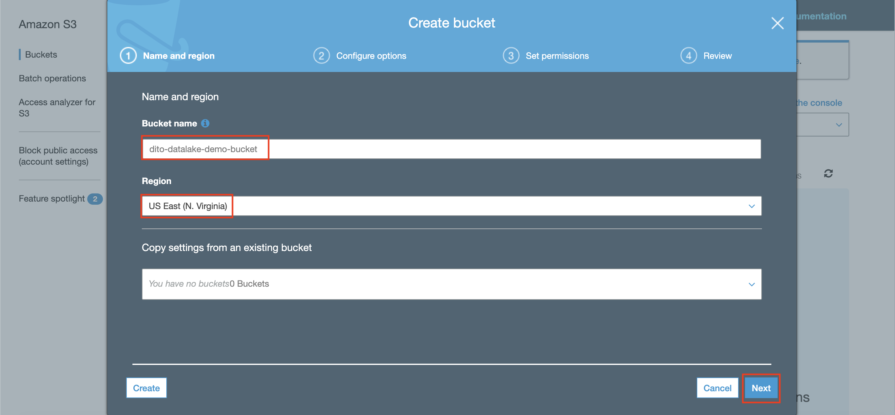
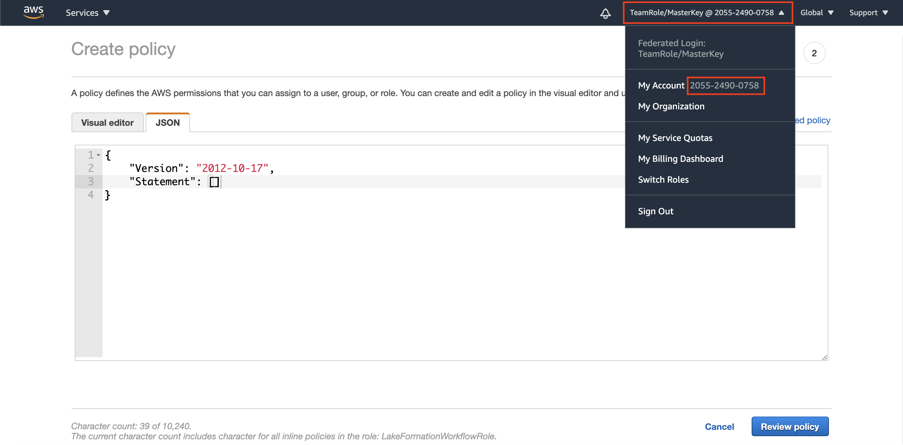

## Integrate Database to Data Lake

We are going to create the data lake and integrate the data lake with the database.
1. Go to [AWS Console](https://console.aws.amazon.com/console/home?region=us-east-1#)
2. Type `S3` and click the S3 menu
    
3. click "Create bucket"
    

What you need to know about the S3 is for the bucket name, it needs to be uniquely available. so different names for each bucket is required.

4. in bucket name, fill as "'yourname'-datalake-demo-bucket"
5. Leave the region in US East
6. click "Next"
    

There will be properties menu open. right here, you can enable versioning, access logging, tags, etc. for this workshop, we are going to skip all of those.

7. click "Next"
8. ensure that block all public access is being checked
9. click "Next"
    
10. in review page, click "Create bucket"

The data lake is going to be automatically created.

Then, we need to create data catalog. This data catalog will then be useful for ETL process and transfer the data to data warehouse. To create data catalog incrementally from Database service (RDS), we need to use Lake Formation. one of the feature in lake formation helps to incrementally creating the snapshot that will be saved to the data lake and create data catalog automatically. by using blueprint existed on Lake formation, this can be done.

Before using Lake formation, first we need to create the permission.

11. go to [IAM Console](https://console.aws.amazon.com/iam/home?region=us-east-1#/home)
12. click "Roles" at the left menu.
13. click "Create role"
    
14. click "AWS Service" and click "Lake Formation"
15. click "Next: permission"
    
16. search for "AWSGlueServiceRole" and check the checkbox at the left side of the policy
    
17. search for "AmazonRDSFullAccess" and check the checkbox at the left side of the policy
    
18. search for "AmazonS3FullAccess" and check the checkbox at the left side of the policy
19. click "Next: tags"
    
20. click "Next: review"
21. in the role name, type "LakeFormationWorkflowRole"
22. click "Create role"
    
23. in role page, search for "LakeFormationWorkflowRole"
24. click the role
    
25. in permission tab, click "Add inline policy"
    
26. in create policy page, click "JSON" page
27. click the menu above the page, and take a look at your account number (12 digits) copy the account number and remove the dash '-'
    
28. please paste the below code and please replace the word "accountNumber" with your 12 digits of your account number.
```
{
    "Version": "2012-10-17",
    "Statement": [
        {
            "Effect": "Allow",
            "Action": [
                "lakeformation:GetDataAccess",
                "lakeformation:GrantPermissions"
            ],
            "Resource": "*"
        },
        {
            "Effect": "Allow",
            "Action": [
                "iam:PassRole"
            ],
            "Resource": [
                "arn:aws:iam::accountNumber:role/LakeFormationWorkflowRole"
            ]
        }
    ]
}
```
29. click "Review policy"
    
30. in policy name, type "LakeFormationWorkflow"
31. click "Create policy"
    

Once the permission has been created, we can set the lake formation and ready to use it.

32. go to [Lake formation Console](https://console.aws.amazon.com/lakeformation/home?region=us-east-1#)
33. click "Add administrators"
    
34. in IAM users, choose your account as a user.
35. click "Save"
    

Once it's done, We need to register the place for our data lake in lake formation.

36. click the 3 stripes at the top left page to open the menu.
    
37. click "Dashboard" at the left menu
38. click "Register location" in stage 1 section
    
39. in register location page, click the browse for S3 path and choose your data lake
40. click "Select"
    
41. click "Register location"
    

Once it's done, we need to create a database.

42. click "Databases" at the left menu
43. click "Create database"
    
44. in database name, type "classicmodels"
45. in location, click browse and choose your data lake
46. click "Select"
47. Type "/LakeFormation" at the end of your s3 path
48. uncheck the "Use only IAM access control for new tables in this database"
49. click "Create database"
    

it will create the database automatically. Now we need to allow our IAM roles to access the database.

50. click "Databases" at the left menu
51. click the radio button at our database
52. click "Actions" and click "Grant"
    
53. choose your IAM Role "LakeFormationWorkflowRole"
54. in database permission, check all the permissions
55. in grantable permissions, check all the permissions
56. click "Grant"
    

After granting the database, we can create the blueprint to generate data catalog and data snapshot incrementally and automatically.

57. click "Blueprints" at the left menu
58. click "Use blueprint"
    
59. in blueprint setting, choose "Icremental database"
60. in database connection, choose your connection ("RDSConnection")
    
61. in source data path, type "classicmodels/%" to declare the whole entire tables in database "classicmodels"
62. in incremental data, declare each tables in the specification as below table. Click Add to add another table. You need to click it 7 times to add another 7 tables.

    | Table name | Bookmark Keys | Bookmark order |
    | --- | --- |
    | customers | customerNumber | Ascending |
    | employees | employeeNumber | Ascending |
    | offices | officeCode | Ascending |
    | orderdetails | orderNumber | Ascending |
    | orders | orderNumber | Ascending |
    | payments | customerNumber | Ascending |
    | productlines | productLine | Ascending |
    | products | productCode | Ascending |
    
    
63. in import target, choose "classicmodels" as the target database
64. in target storage location, click browse and choose your data lake
65. Add "/LakeFormation" at the end of your data lake (S3) path
66. in data format, leave it as "parquet"
67. in import frequency, choose "Daily" and set the time as 0 hour and 0 minute
    
68. in import options, type the workflow name as "WF-classicmodels"
69. in IAM role, choose "LakeFormationWorkflowRole"
70. in table prefix, type "classicmodels"
71. in concurrency, change it to 10
72. click "Create"
    

it will take around a minute to create the blueprint. once the blueprint is done, we can run the workflow.

73. in workflow, click your Workflow "WF-classicmodels"
    
74. click "Start"
    

The process will take around 15 until 30 minutes to run the workflow. Now, we are going to monitor the process of the workflow.

75. click "View graph". it will open a new tab to glue workflow
76. click "History"
77. click the radio button besides the run ID
78. click "View run details"
    

you might see the steps on the workflow is going to be executed at.
    

Once the execution is finished, it will display the run state as "Completed"
    

Now, we can check our data lake if the data has been crawled.

79. go to [S3 Console](https://s3.console.aws.amazon.com/s3/home?region=us-east-1)
80. click your S3 bucket ("yourname-datalake-demo-bucket")
81. click "LakeFormation" folder
    

it will display all the data that has been crawled.
    

Now, let's check the data more detail

82. go to [Athena Console](https://console.aws.amazon.com/athena/home?region=us-east-1#query)
83. click "Settings" at the top of the page
    
84. in query result location, fill it with format "s3://yourname-datalake-demo-bucket/athena"
85. click "Save"
    
86. in database, choose "classicmodels"
87. in tables, click the 3 dots at the right side of customers table
88. click "preview tables"
    

it will display the data that has been crawled from previous step at lake formation.
    

[BACK TO WORKSHOP GUIDE](../../README.md)