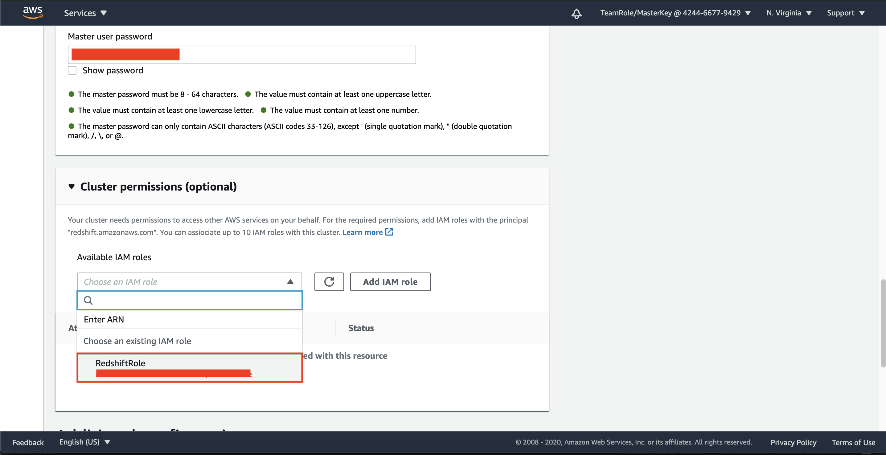
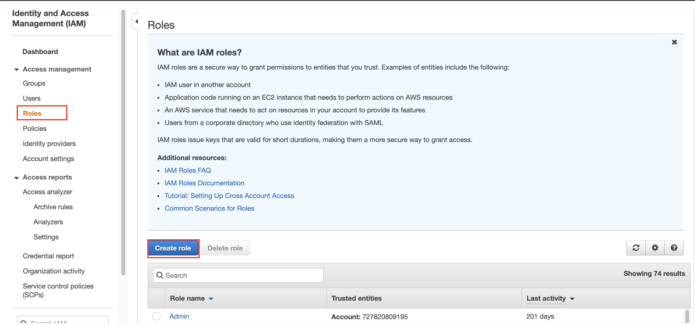
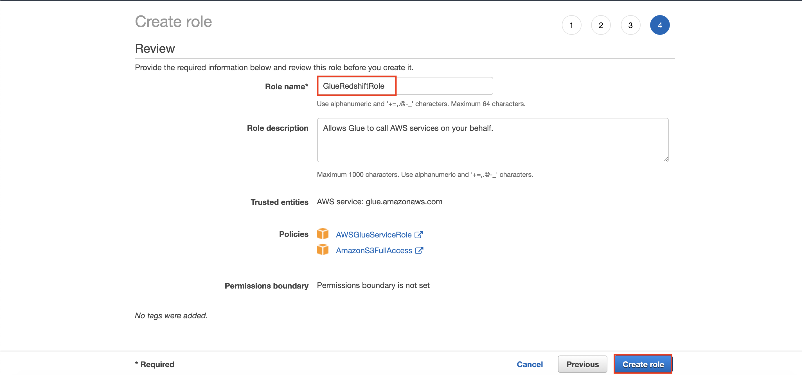

## Create Data Warehouse (Redshift)

1. Go to [AWS Console](https://console.aws.amazon.com/console/home?region=us-east-1#)
2. Type `IAM` and click the IAM menu
    
3. click `Roles` at the left menu
4. click `Create role`
    
5. in role page, select `AWS service` and find `Redshift`
6. in use case, click `Redshift - Customizable`
7. click `Next: Permissions`
    
8. in policy page, in search box type `AmazonS3FullAccess`
9. click the checkbox at the policy name
    
10. erase the search box and type `AWSGlueConsoleFullAccess`
11. click the checkbox at the policy name
12. click `Next: tags`
    
13. click `Next: review`
14. in role name, Type `RedshiftRole`
15. click `Create Role`
    

Now, after we create a permission for our data warehouse to be able to acess the data from the data catalog, we need to create the data warehouse.

16. go to [Redshift Console](https://console.aws.amazon.com/redshiftv2/home?region=us-east-1#landing)
17. click `Clusters` at the left menu
18. click `Create cluster`
    
19. in cluster identifier, replace the name and change it to `redshift-dwh`
    
20. in node type, choose `dc2.large`
21. in nodes, type 2.
    
22. in database configurations section, put the master user name as `admin`
23. fill the password.
    
24. expand `Cluster permissions`
25. in IAM roles, choose `RedshiftRole`
    
26. Click `Create cluster`

It will take several minutes to create the cluster. During this time, we will create S3 gateway endpoint to access your data from data lake by using AWS internal connection instead of exposing your data through the public internet.

27. go to [VPC Console](https://console.aws.amazon.com/vpc/home?region=us-east-1#)
28. click `Endpoints` at the left menu
29. click `Create endpoint`
    
30. in Endpoint section, type `S3` at the search box and type enter. it will display the service name.
31. click the radio button at the left side of the service name.
    
32. in VPC Section, since we were creating the data warehouse in default VPC, you need to choose your default VPC.
33. Check the route table checkbox. remember the ID
    
34. click `Create endpoint` at the page below.
35. click `Close`

it will create the endpoint. We need to give the endpoint a name

36. at endpoint page, hover your cursor to the name field, and click the pencil button.
37. Type `RedshiftS3EP`
    

Now, we need to find the prefix list that we have included at the route table.

38. click `Route tables` at the left menu of VPC
39. find the route table you have checked previously during endpoint creation. click the box besides the route table id
40. click routes tab
41. in destination, you will see the prefix list at the route (starts with pl-). copy the prefix list, we will need it at the next step
    

We need to verify if the security group have received the rules from the endpoint.

42. go to [Redshift Console](https://console.aws.amazon.com/redshiftv2/home?region=us-east-1#landing)
43. click `Clusters` at the left menu
44. click your data warehouse (`redshift-dwh`)
45. click `properties` tab
    
46. click your VPC security group (start with sg-)

It will open a new tab

you need to check if there is another rules except all traffic from the security group. if the rule is only one, you need to edit the rule.

47. click `inbound rules`
48. click `Edit inbound rules`
    
49. click `Add rule`
50. In type, choose `HTTPS`
51. in source, fill the prefix list you have found at the route table (starts with pl-)
52. click `Save rules`
    

We also need to modify the outbound rules.

53. click `Outbound rules`
54. click `Edit outbound rules`
    
55. click `Add rule`
56. In type, choose `All TCP`
57. in source, type `sg` and choose default security group
58. click `Save rules`
    

Now, we need to connect the data warehouse (Redshift) with our ETL service (glue)

59. go to [Glue Console](https://console.aws.amazon.com/glue/home?region=us-east-1)
60. click `Connections` at the left menu
61. click `Add connection`
    
62. in connection name, type `RedshiftConnection`
63. in Connection type, choose `Amazon Redshift`
64. Click `Next`
    
65. in setup access to data store page, choose your data warehouse cluster name (`redshift-dwh`)
66. in database name, leave it as `dev` and for the username, leave it as `admin`
67. type your password.
68. click `Next`
    
69. Click `Finish`

After creating the connection, we need to create a permission before testing the connection.

70. go to [IAM Console](https://console.aws.amazon.com/iam/home?region=us-east-1#/home)
71. click `Roles` at the left menu
72. click `Create role`
    
73. choose `AWS service` in trusted entity
74. click `glue` in service list
75. click `Next: permission`
    
76. in search textbox, type `AWSGlueServiceRole` and click the checkbox at the left side of the policy
    
77. in search textbox, type `AWSGlueServiceRole` and click the checkbox at the left side of the policy
78. click `Next: tags`
    
79. click `Next: review`
80. in Review page, fill the name with `GlueRedshiftRole`
81. click `Create role`
    

Now, we are able to test the connection.

82. go to [Glue Console](https://console.aws.amazon.com/glue/home?region=us-east-1)
83. click `Connections` at the left menu
84. click the checkbox at your connection (`RedshiftConnection`)
85. click `Test connection`
    
86. in IAM role, choose your IAM role you have created (`GlueRedshiftRole`)
    

It will take several minutes to test the connection.

Once it's done, it will display like below
    

Now, we need to create the schema at our data warehouse.

87. go to [Redshift Console](https://console.aws.amazon.com/redshiftv2/home?region=us-east-1#landing)
88. click `Editor` at the left menu
89. choose your cluster (`redshift-dwh`)
90. in database, type `dev`
91. for database user, type `admin`
92. fill your database password
    
93. click `Connect to database`

Now, we need to create the schema and all tables.

94. Please download [this query](../../files/DLAndDWH/DWH/Redshift-DDL.sql) and execute it for each of them consecutively. don't change the order of the table execution.
Example: 
    
    

once you are done, it will create every table.
    

[BACK TO WORKSHOP GUIDE](../../README.md)