## Catalog the data in data lake

1. Go to [AWS Console](https://console.aws.amazon.com/console/home?region=us-east-1#)
2. Type `Glue` and click the Glue menu
    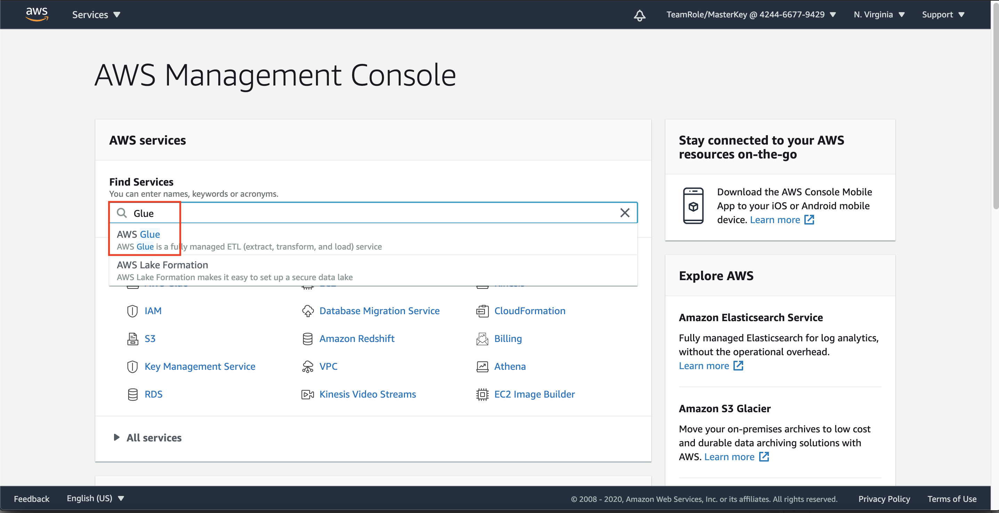
3. Click `Crawlers` at the left menu
4. click `Add crawler`
    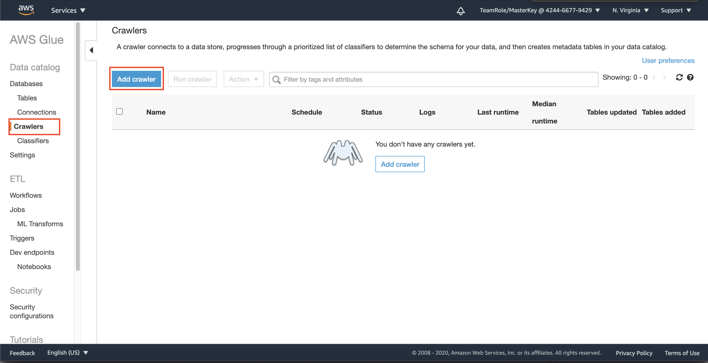
5. Fill the name of the crawler with `RDSDataLakeCrawler`
6. in Specify crawler source type, choose `Data stores`
7. click `Next`
    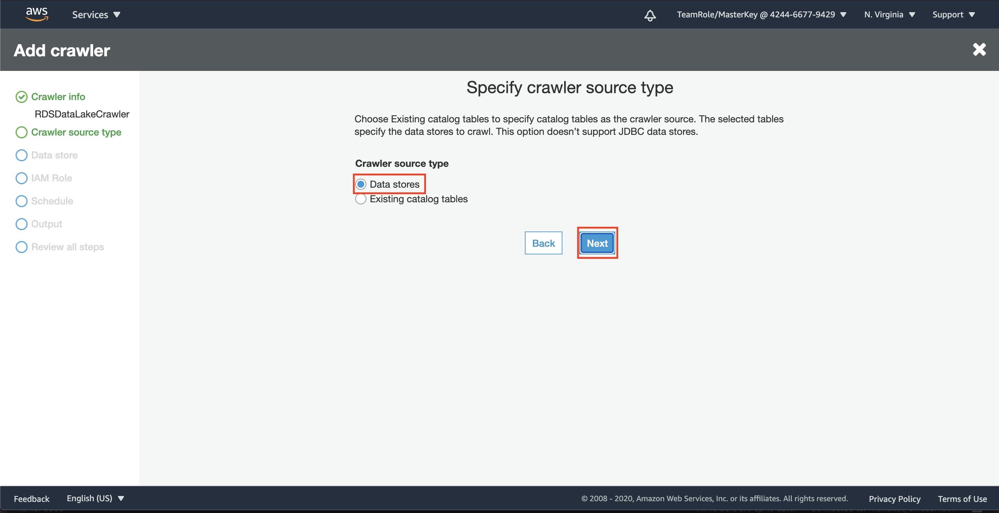
8. in add data store, choose S3 as a data store
9. in path. click the folder button
    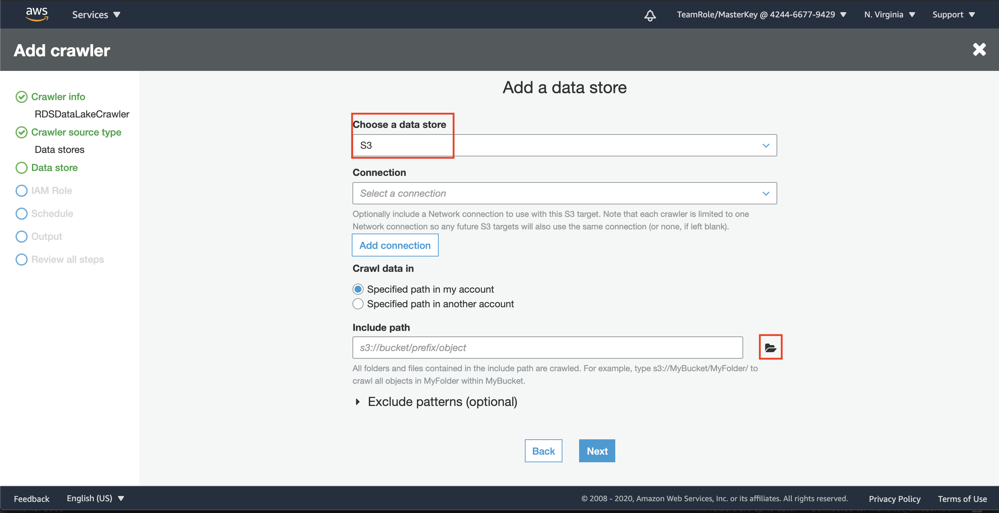
10. in choosing S3 path, choose `classicmodels`
11. click `Select`
    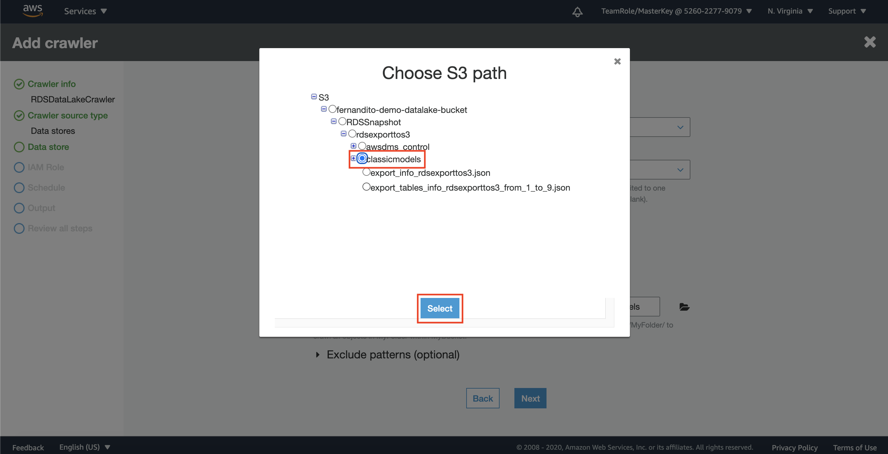
12. click `Next`
    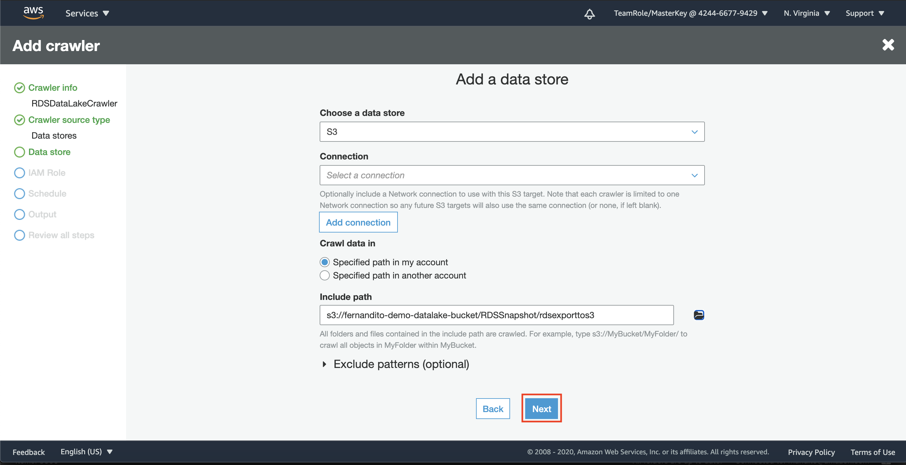
13. in add another data store page, choose `No` and click `Next`
14. in IAM Role, choose `Create an IAM role`
15. in IAM role textbox, type `RDSSnapshotCrawler`
16. click `Next`
    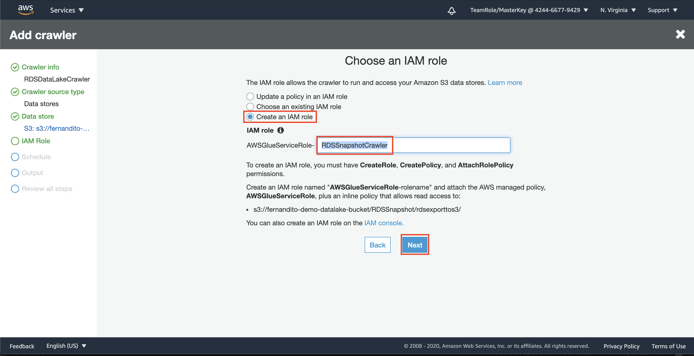
17. in crawler scheduler page, choose `Run on demand` and click `Next`
    
18. in database page, click `Add database`. it will display the pop up menu
19. for database name, type `classicmodels`
20. click `Create`
    
21. at the configure crawler output page, click `Next`
22. in review page, click `Finish`

it will create the crawler to crawl the data from data lake. Now, we need to give the permission to the crawler to access S3 (data lake)

23. go to [IAM Console](https://console.aws.amazon.com/iam/home?region=us-east-1#/home)
24. click `Roles` at the left menu
25. in the search bar, type `RDSSnapshotCrawler`
26. click the role
    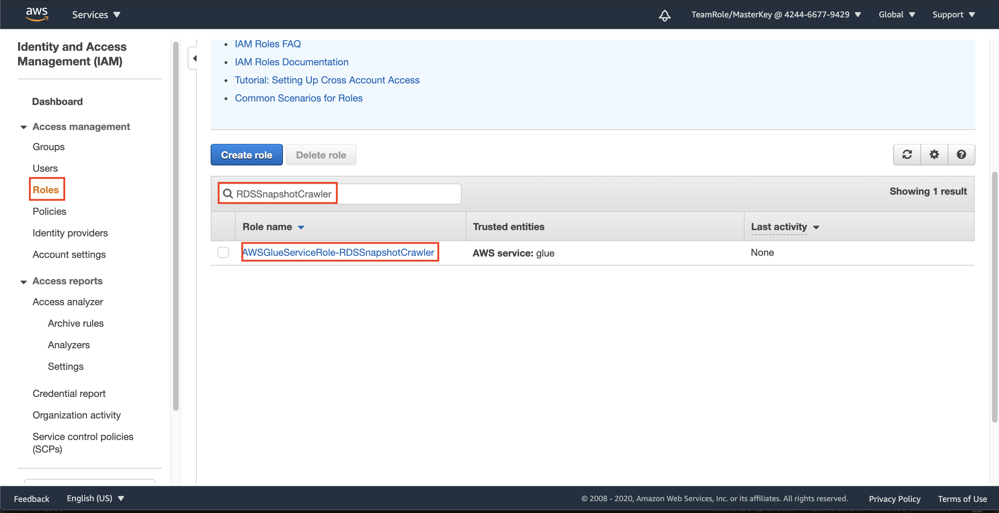
27. click `Attach policies`
    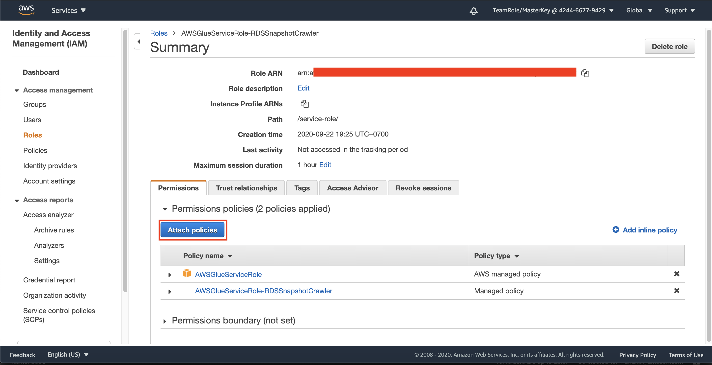
28. in search bar, type `S3Full`
29. Click the checkbox at the left side of the policy name
30. click `Attach policy`
    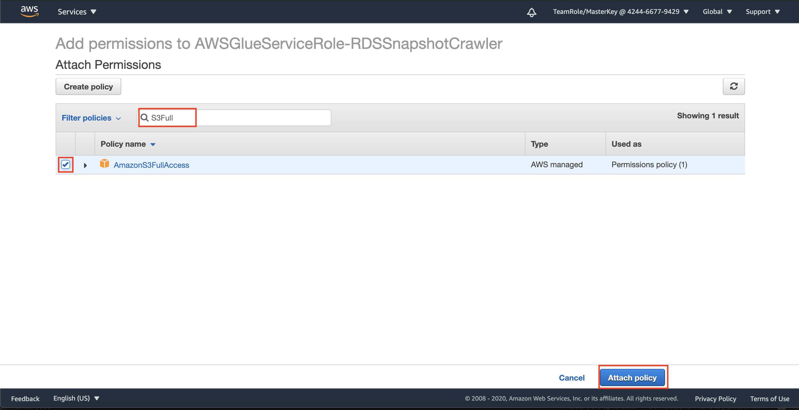

After attaching the Permission for accessing the data lake, now we need to allow the crawler to decrypt the data.

31. go to [KMS Console](https://console.aws.amazon.com/kms/home?region=us-east-1#/kms/home)
32. click `Customer managed keys`
33. Click your key (`RDSSnapshotKey`)
    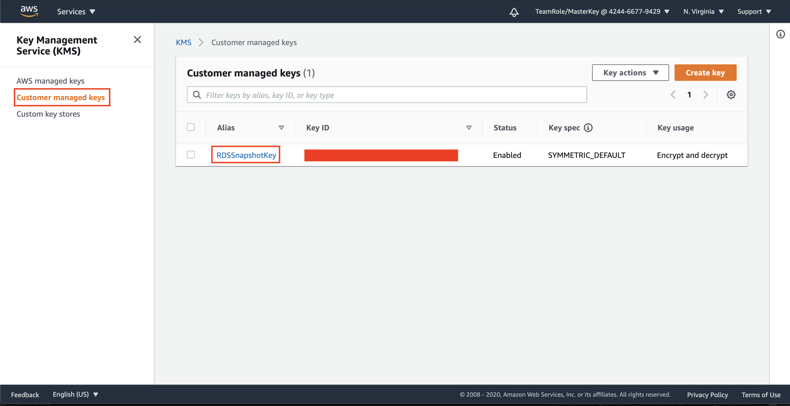
34. In key users, click `Add`
    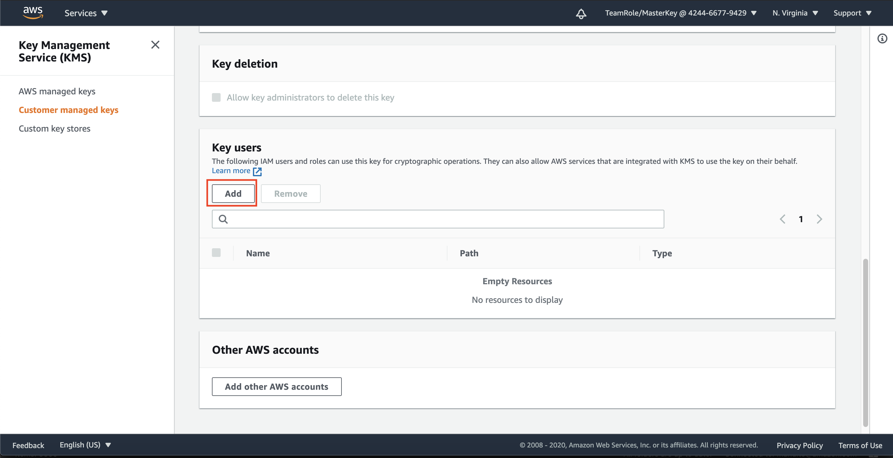
35. In search bar, type `RDSSnapshotCrawler`
36. click the checkbox at the left side of your role
37. click `Add`
    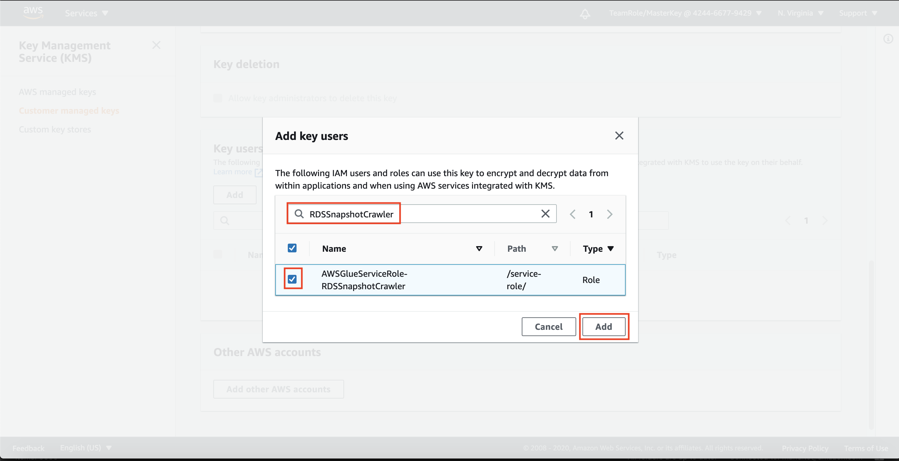

Now, we can run the crawler we have created previously.

38. go to [Glue Console](https://console.aws.amazon.com/glue/home?region=us-east-1)
39. click `Crawler` at the left side of the menu.
40. click the checbox at the left side of your crawler (`RDSDataLakeCrawler`)
41. click `Run crawler`
    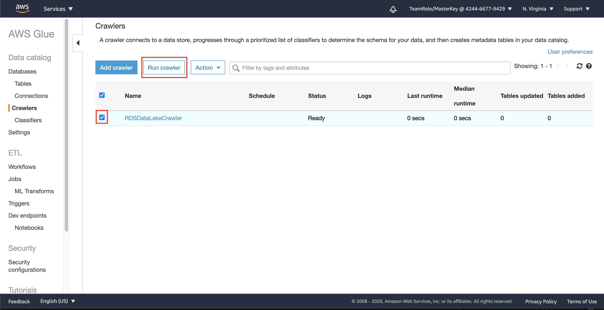

it will take a few minutes to run the crawler. it will create a data catalog from your data lake to be accessed anywhere else.

once the crawler is done, it will display the `Ready` status and create 8 tables.
    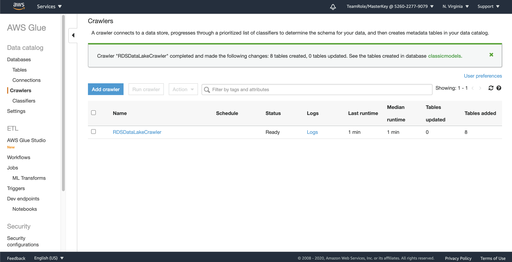

We need to check the data.

42. Click `Databases` at the left menu
43. click your database (`classicmodels`)
    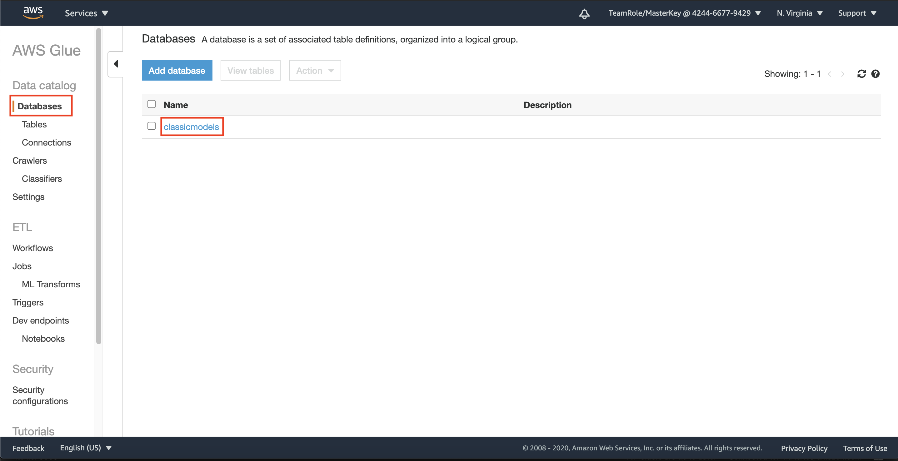
44. click `Tables in classicmodels`

it will display all tables that has been crawled.
    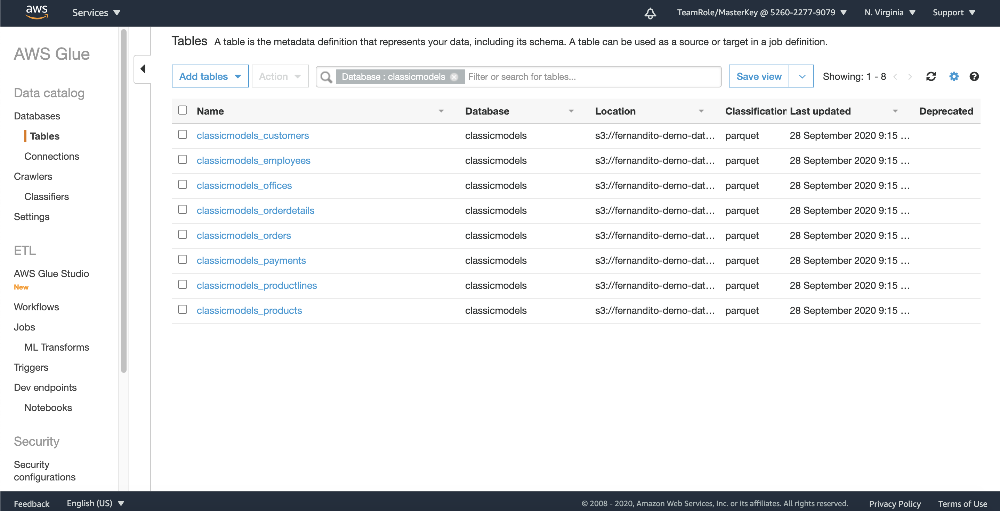

[BACK TO WORKSHOP GUIDE](../../README.md)