## ETL (Extract, Transform, Load) from Data Lake to Data Warehouse

1. Go to [AWS Console](https://console.aws.amazon.com/console/home?region=us-east-1#)
2. Type `Glue` and click the Glue menu
    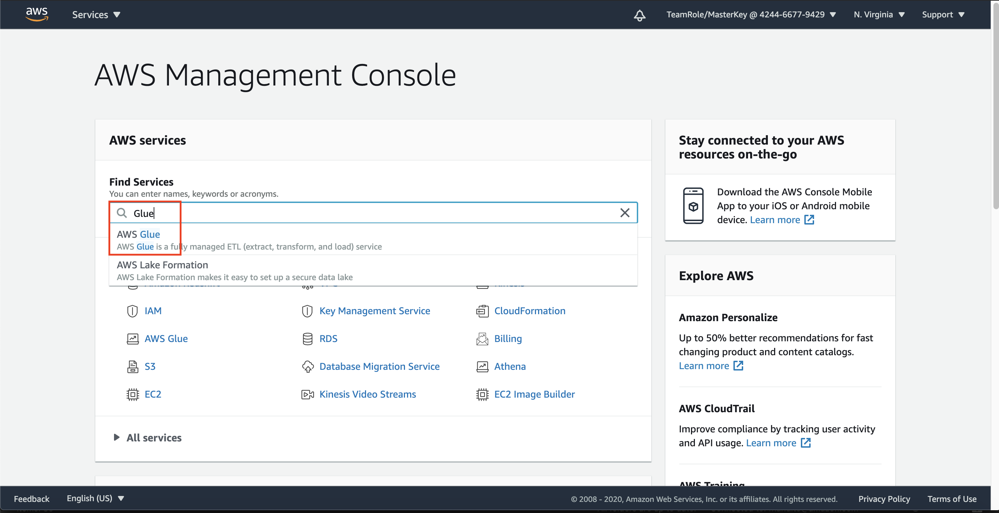
3. click `Jobs` at the left menu
4. click `Add Job`
    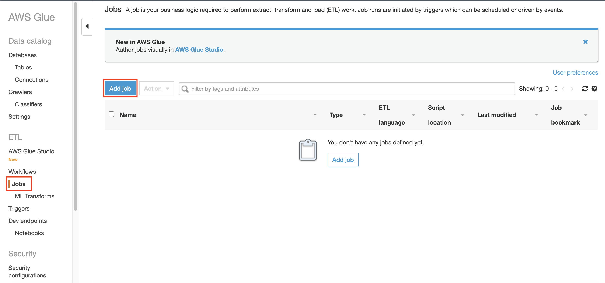
5. in Job name, type `RedshiftETLJob`
6. in IAM role, choose `LakeFormationWorkflowRole`
    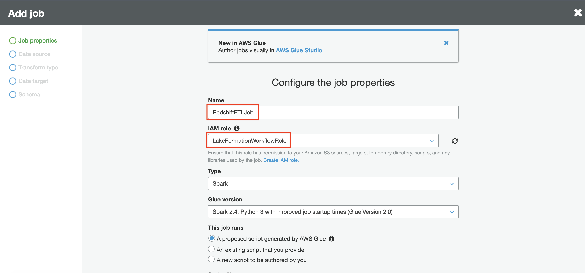
7. in job runs, choose `A new script to be authored by you`
8. in S3 Path where the script is stored, click the folder logo and choose your data lake (`yourname-datalake-demo-bucket`)
9. add `/ETLCode` at the end of your path
10. in temporary directory, click the folder logo and choose your data lake (`yourname-datalake-demo-bucket`)
11. add `/tmp` at the end of your path
    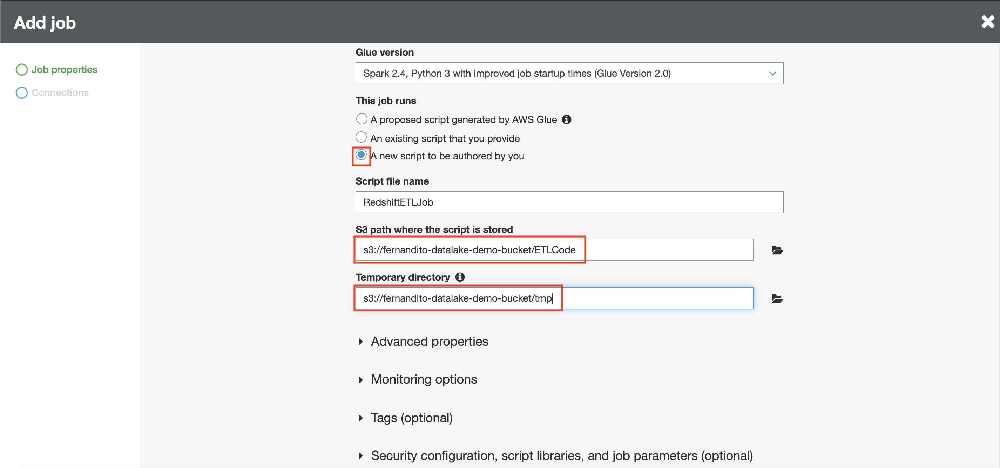
12. open advanced properties
13. make sure that the job bookmark is `Disable`
14. click `next`
    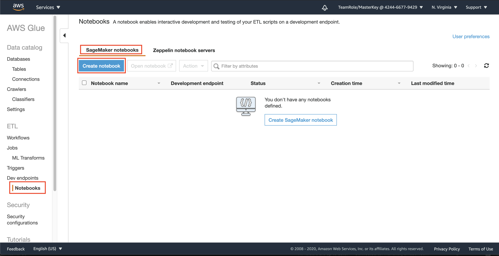
15. in connections page, click select on `RedshiftConnection`
16. click `Save job and edit script`
    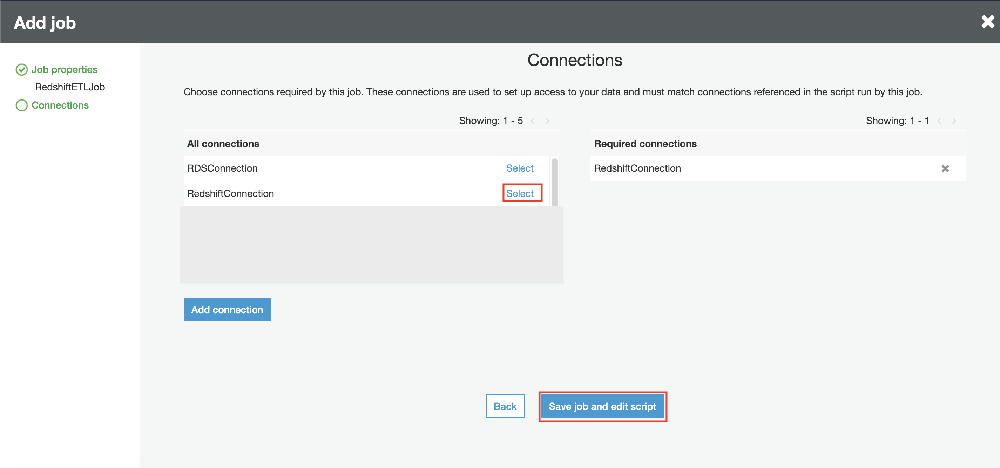

it will bring you to text editor where you can code right there for your ETL process. Now, let's import the code that have been prepared.

17. Download [This Python script](../../files/DLAndDWH/ETL/RedshiftETL.py) and open the file.
18. copy all the scripts and paste it right at the text editor

you may read the script to get the guidance on what is the ETL in the code is going to do.

19. click `Save`
    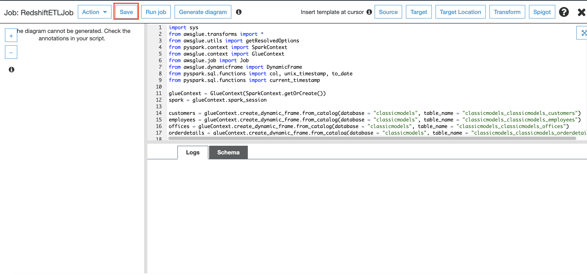

Once the job has been created, we can test the job by running the job.

20. click `Run Job`
    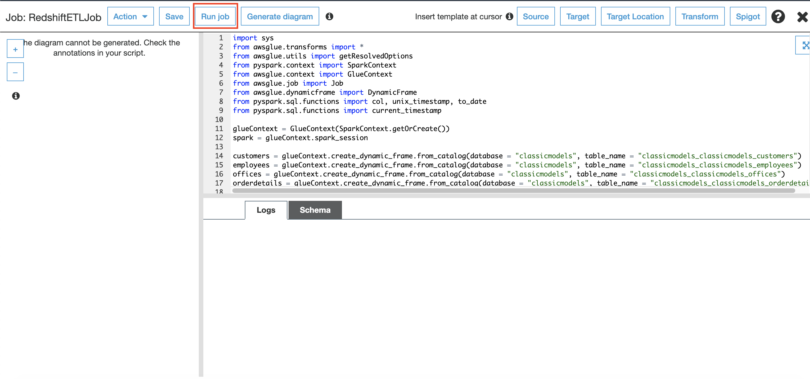
21. in parameters menu, click `Run job`
    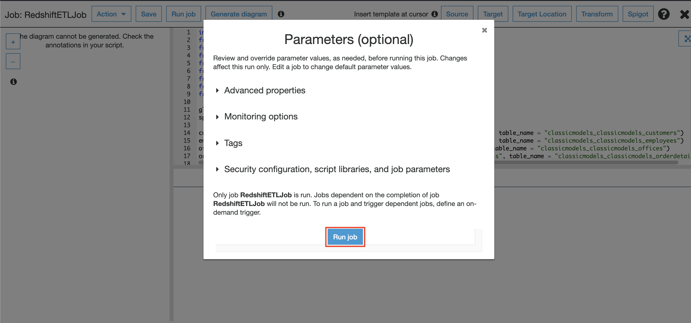

it will run the script that you have provided. it will take around 5 minutes. It will display the logs at the below part of the page
    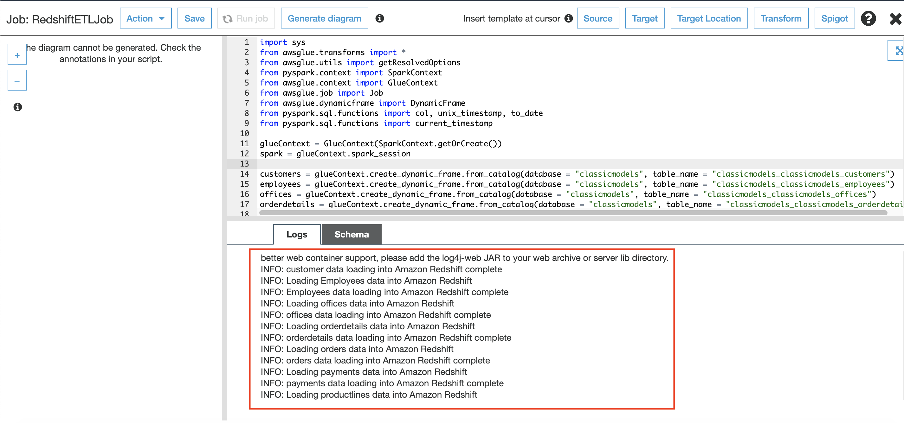

it's going to be done after it stated `INFO: products data loading into Amazon Redshift complete`

Now, we are going to schedule this job so it will be automatically run based on a specified time.

22. click `X` at the right page
    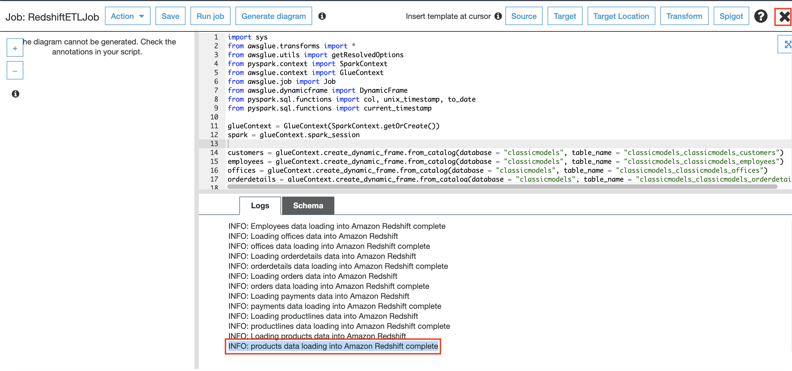
23. in glue console, click `Triggers`
24. click `Add trigger`
    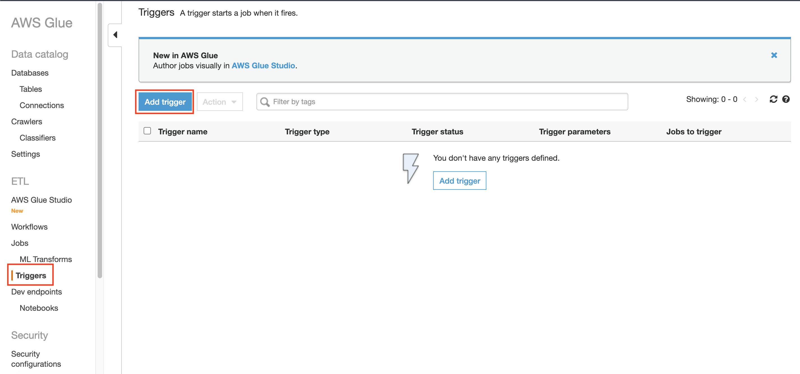
25. in Trigger name, type `RedshiftETLJobTrigger`
26. choose `Schedule` as a trigger type
27. in Frequency, choose `Daily`
28. in Hour, set it to 2 and minute set it to 0
29. click `Next`
    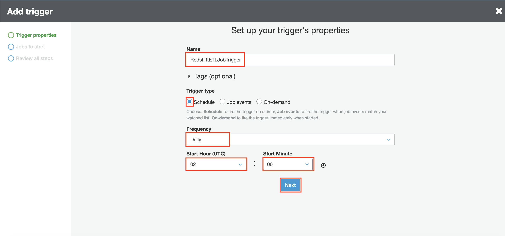
30. in jobs to trigger, click `Add` on `RedshiftETLJob`
    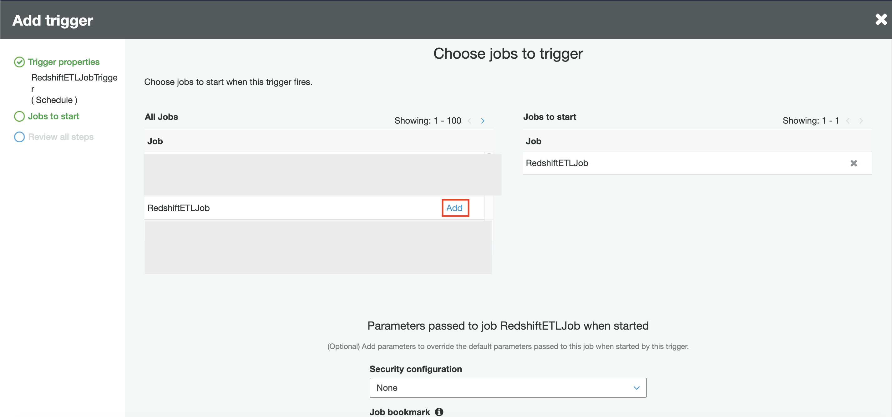
31. click `Next` at the below page.
32. in review page, click `Finish`

It will create a schedule to run the job at 2 AM daily.

since we have run the job previously, means that the data has been loaded to the redshift. We need to test the data.

33. go to [Redshift Console](https://console.aws.amazon.com/redshiftv2/home?region=us-east-1#dashboard)
34. click `Editor` at the left menu
    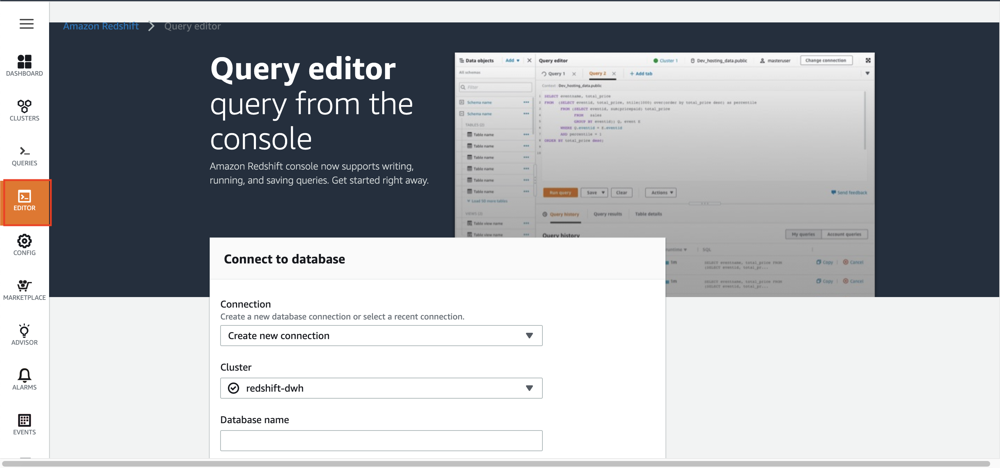

usually, if you have logged in in not a long time, it will re-login automatically. But, if you have logged out, you need to login again.

35. in connection, choose `Create new connection`
36. in cluster, choose `redshift-dwh`
37. in database name, type `dev`
38. in database user, type `admin`
39. in database password, type your password.
40. click `Connect to database`
    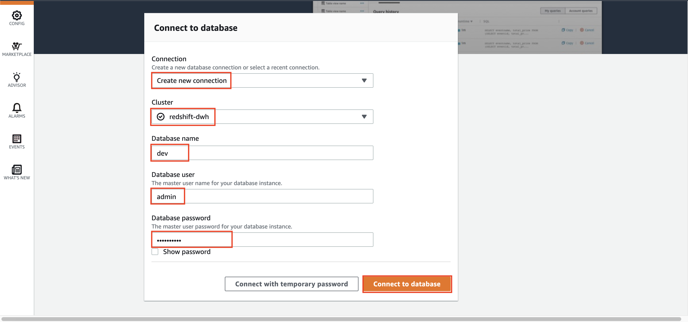
41. check if the schema is `classicmodels`
    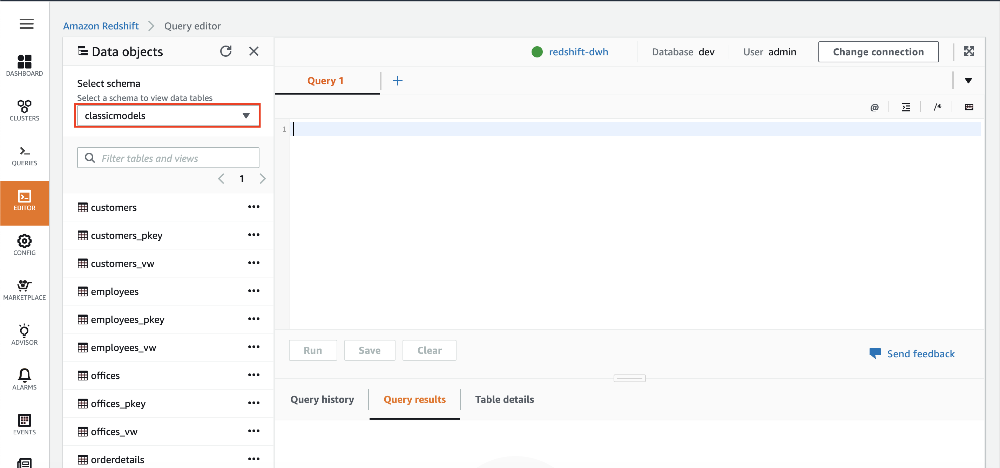
42. Please copy this query below to test it out
```
SELECT 
    prod.productName,
    SUM(odrdtl.quantityOrdered) AS SumQtyOrder,
    COUNT(cust.customerName) AS TotalCustomer
FROM classicmodels.customers cust
JOIN classicmodels.orders odr ON cust.customerNumber = odr.customerNumber
JOIN classicmodels.orderdetails odrdtl ON odr.orderNumber = odrdtl.orderNumber
JOIN classicmodels.products prod ON odrdtl.productCode = prod.productCode
WHERE DATEDIFF(day, (SELECT MAX(orderDate) FROM classicmodels.orders), odr.orderDate) <= 90
GROUP BY 
    prod.productName
ORDER BY SumQtyOrder DESC;
```

it will display the trends of which product has the most orders from the past 3 months.
    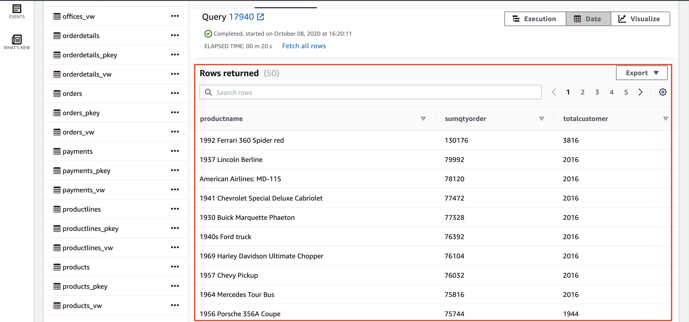

[BACK TO WORKSHOP GUIDE](../../README.md)