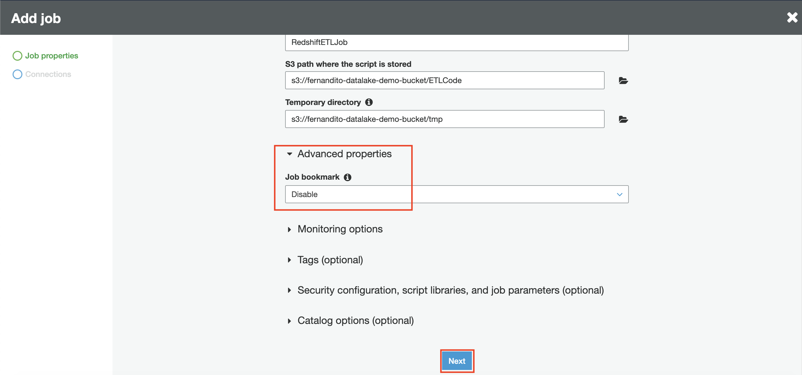

## ETL (Extract, Transform, Load) from Data Lake to Data Warehouse

1. Go to [AWS Console](https://console.aws.amazon.com/console/home?region=us-east-1#)
2. Type `Glue` and click the Glue menu
    
3. Click "Dev endpoints" at the left menu
4. click "Add endpoint"
    

We need to create the endpoint so that it will be able to receive the code from us. this code will be used for ETL Process

5. in Development endpoint name, type "ETLClassicmodelsEP"
6. in IAM Role, use "RDSSnapshotCrawler"
7. click "Next"
    
8. in networking page, click "Choose a connection"
9. in connection, choose "RedshiftConnection"
10. click "Next"
    
11. in SSH public key page, click "Next"
12. in review page, click "Finish"
    

This process will take several minutes to be done.

Once the endpoint is done, it will show "Ready" status. Now, we can use the endpoint.

13. in Glue console, click "Notebooks" at the left menu
14. in SageMaker notebooks tab, click "Create notebook"
    
15. in Notebook name, type "ETLClassicmodelsNB"
16. in IAM role, choose "Create an IAM role"
17. type the IAM role as "RedshiftETLNotebook"
    
18. click "Create notebook"

it will take few minutes to create the notebook environment.

once it's done, it will display "Ready" status. We need to attach the role from the notebook to be able to access the data lake (S3)

19. go to [IAM Console](https://console.aws.amazon.com/iam/home?region=us-east-1#/home)
20. click "Roles" at the left menu
21. Type "RedshiftETLNotebook" at the search bar
22. click the role name
    
23. In permission tab, click "Attach policies"
    
24. In search bar, type "S3Full"
25. click the checkbox at the policy name.
26. click "Attach policy"
    

Once we are done with the permission, we need to open the notebook.

27. go to [Glue Console](https://console.aws.amazon.com/glue/home?region=us-east-1)
28. click "Notebooks" at the left menu
29. click the notebook name ("ETLClassicmodelsNB")
    
30. click "Open"
    

it will mention that you will access sagemaker notebook.

31. click "Ok"

it will open a new tab and open the environment of sagemaker notebook. Now, we need to import the notebook.

32. Download this notebook.
33. click Upload and choose the downloaded notebook.
    
34. click "Upload" button to confirm upload the notebook.
    
35. click the notebook and follow the instruction at the notebook.

Once the ETL process has been done, we need to check it to our data warehouse if the data has been transferred.

36. go to [Redshift Console](https://console.aws.amazon.com/redshiftv2/home?region=us-east-1)
37. Click "Editor" at the left menu.

if you ever configured a connection before, it will be automatically connected by using previous configuration. if not, please follow this instruction below

38. choose your cluster ("redshift-dwh")
39. in database, type "dev"
40. for database user, type "admin"
41. fill your database password
    
42. click "Connect to database"

Once you create the connection, it will show the query editor. we need to take a look at the data.

43. choose "classicmodels" at select schema
44. at customer table, click the vertical 3 dots, and choose "preview data"
    

It will display the data at the lower page.
    

[BACK TO WORKSHOP GUIDE](../../README.md)