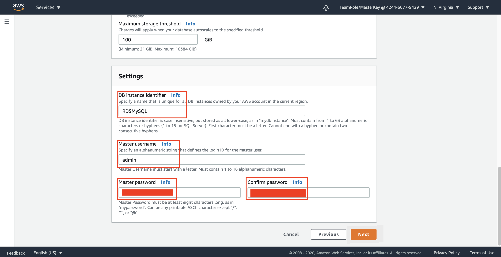

## Create RDS Database

1. Go to [AWS Console](https://console.aws.amazon.com/console/home?region=us-east-1#)
2. Type `RDS` and click the RDS menu
    
3. Click `Subnet Group`
4. Click `Create DB Subnet Group`
    
5. Fill the name with `RDSMySQLSubnetGroup`
6. Fill the Description with `RDS MySQL Subnet Group`
7. Choose the VPC You have created (`DatabaseVPC`)
    
8. in Availability Zone, checklist all of it.
    
9. in Subnets, choose subnet in us-east-1c and us-east-1d
    
10. Click `Create`

It will create the subnet group for your database.

Now, we need to create the security group for the database

12. go to [EC2 Console](https://console.aws.amazon.com/ec2/v2/home?region=us-east-1#)
13. Click `Security Group` at the left menu
14. Click `Create Security group`
    
15. Fill Security group name as `RDSMySQLSG`
16. Fill Description as `RDS MySQL Security Group`
17. Choose the VPC You have created (`DatabaseVPC`)
    
18. in Inbound rules, click `Add rule`
19. Find type `MySQL/Aurora` with Source custom of `10.0.0.0/16`. This is your VPC CIDR
20. Click `Add rule` again
21. Find type `MySQL/Aurora` with Source my IP

It will look like as below:
    

22. Click `Create security group`

Once it's done, we need to create Database instance on RDS.

23. Go to [RDS Console](https://console.aws.amazon.com/rds/home?region=us-east-1#)
24. Click `Databases` at the left menu
25. Click `Create Database`

it will display the options for databases you can use.
    

26. Choose `MySQL` database on Engine options.
    
27. Click `Next`
28. in use case, choose `Dev/Test - MySQL`
29. Click `Next`
    
30. Checklist the checkbox of `Free tier`
    
31. Change the maximum storage threshold to `100` GiB in Storage autoscaling
    
32. In settings, typeRDSMySQL the DB instance identifier with `RDSMySQL`
33. type the master username as `admin`
34. input your password and confirm password
    
35. go to the top of the page and ensure you choose version `5.7.31`
    
36. at the bottom page, click `Next`
37. In network and security, choose your VPC (`DatabaseVPC`)
38. Choose your subnet group (`rdsmysqlsubnetgroup`)
39. Click `Yes` for the public accessibility radio button
40. in Availability zone, choose `us-east-1c`
41. in VPC security groups, click `choose existing VPC security groups`
42. remove the default security group and choose `RDSMySQLSG`
    
43. Scroll down and click `Create database` at the below page.
44. Click `View DB instance details`

Wait until the status of the database says `Available`. It will take couple of minutes.

You will connect to your EC2 instance. now, we need to connect to our RDS instance using this EC2 instance. We are going to use the previous instance you have created on EC2

45. go to [EC2 Console](https://console.aws.amazon.com/ec2/v2/home?region=us-east-1#)
46. click `Security groups` at the left menu.
47. search your Security groups `EC2MySQLSG`
48. Click `Inbound rules`
49. click `Edit inbound rules`
    
50. click `Add Rule`
51. in type, select `MySQL/Aurora`
52. in source, type `RDSMySQLSG` and click the security group.
53. click `Save rules`
    

Now, we can connect to our EC2 instance

54. click `Instances` at the left menu
55. click the checkbox at the left side of your instance (`EC2MySQL`)
56. click `connect`
57. open new terminal and copy the SSH syntax at the connect pop-up menu (`ssh -i 'EC2MySQLKey.pem' ...`)

We are going to connect our Database service (RDS) by using our EC2 instance.

58. Go to [RDS Console](https://console.aws.amazon.com/rds/home?region=us-east-1#)
59. click `Databases` at the left menu
60. Click `rdsmysql`. It will display the endpoint, networking, and security of the database at the bottom page.
    
61. Open your EC2 terminal you have connected previously
62. Type 'mysql -h `your RDS Endpoint` -u admin -p'
63. Type your password
    

[BACK TO WORKSHOP GUIDE](../../README.md)