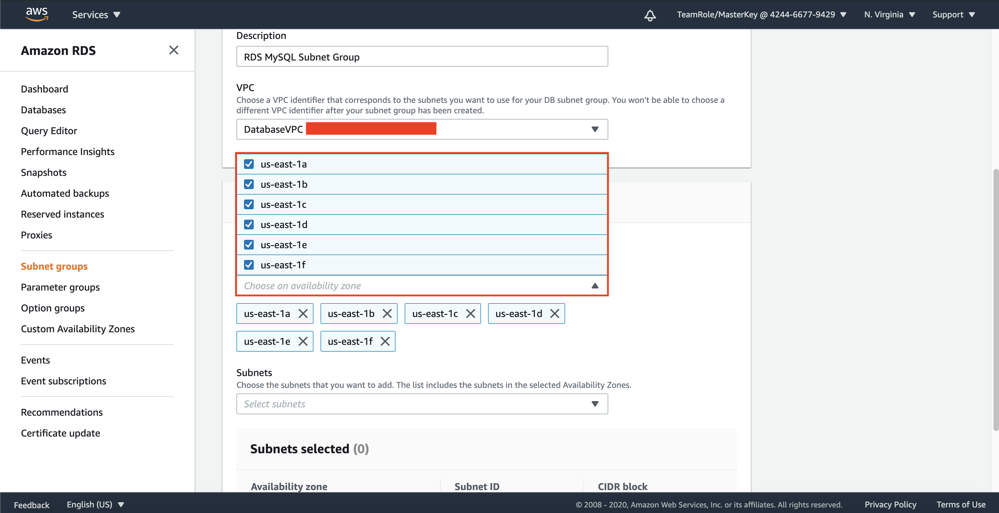

## Create RDS Database

1. Go to [AWS Console](https://ap-southeast-1.console.aws.amazon.com/console/home?region=ap-southeast-1)
2. Type `RDS` and click the RDS menu
    
3. Click `Subnet Group`
4. Click `Create DB Subnet Group`
    
5. Fill the name with `RDSMySQLSubnetGroup`
6. Fill the Description with `RDS MySQL Subnet Group`
7. Choose the VPC You have created (`DatabaseVPC`)
    
8. in Availability Zone, checklist all of it.
    
9. in Subnets, choose all of the subnets available.
    
10. Click `Create`

It will create the subnet group for your database.

12. go to [EC2 Console](https://ap-southeast-1.console.aws.amazon.com/ec2/v2/home?region=ap-southeast-1#Home:)
13. Click `Security Group` at the left menu
14. Click `Create Security group`
    
15. Fill Security group name as `RDSMySQLSG`
16. Fill Description as `RDS MySQL Security Group`
17. Choose the VPC You have created (`DatabaseVPC`)
    
18. in Inbound rules, click `Add rule`
19. Find type `MySQL/Aurora` with Source custom of `10.0.0.0/16`. This is your VPC CIDR
20. Click `Add rule` again
21. Find type `MySQL/Aurora` with Source my IP

It will look like as below:
    

22. Click `Create security group`

Once it's done, we need to create Database instance on RDS.

23. Go to [RDS Console](https://ap-southeast-1.console.aws.amazon.com/rds/home?region=ap-southeast-1)
24. Click `Databases` at the left menu
25. Click `Create Database`

it will display the options for databases you can use.
    

26. Click `Standard Create` for database creation method
27. Click `MySQL`
    
28. in Templates, click `Free tier`
29. in settings, change the DB instance identifier with `RDSMySQL`
30. leave the master username as admin
    
31. fill the master password. make sure to remember your password.
32. fill confirm password.
33. In Storage, change the maximum storage threshold to `100` GiB
    
34. in Connectivity, choose your VPC (`DatabaseVPC`)
35. Click `Additional Connectivity configuration`
36. Ensure that the subnet group is `RDSMySQLSubnetGroup`
37. Click Radio Button `Yes` on Public access
38. Remove `default` on Existing VPC Security Group and Add `RDSMySQLSG`
    
39. Scroll down and click `Create database`

Wait until the status of the database says `Available`. It will take couple of minutes.

We need to test the database.
40. Click `rdsmysql`. It will display the endpoint, networking, and security of the database.
    
41. Open your terminal
42. Type 'mysql -h `your RDS Endpoint` -u admin -p'
43. Type your password
    

[BACK TO WORKSHOP GUIDE](../../README.md)