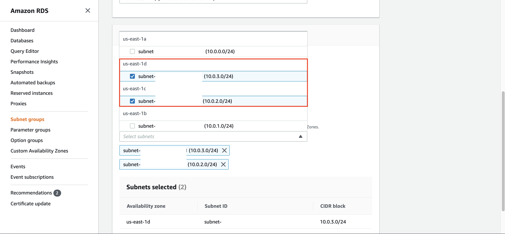

## Create RDS Database

1. Go to [AWS Console](https://console.aws.amazon.com/console/home?region=us-east-1#)
2. Type `RDS` and click the RDS menu
    
3. Click `Subnet Group`
4. Click `Create DB Subnet Group`
    
5. Fill the name with `RDSMySQLSubnetGroup`
6. Fill the Description with `RDS MySQL Subnet Group`
7. Choose the VPC You have created (`DatabaseVPC`)
    
8. in Availability Zone, checklist all of it.
    
9. in Subnets, choose all of the subnets available.
    
10. Click `Create`

It will create the subnet group for your database.

12. go to [EC2 Console](https://console.aws.amazon.com/ec2/v2/home?region=us-east-1#)
13. Click `Security Group` at the left menu
14. Click `Create Security group`
    
15. Fill Security group name as `RDSMySQLSG`
16. Fill Description as `RDS MySQL Security Group`
17. Choose the VPC You have created (`DatabaseVPC`)
    
18. in Inbound rules, click `Add rule`
19. Find type `MySQL/Aurora` with Source custom of `10.0.0.0/16`. This is your VPC CIDR
20. Click `Add rule` again
21. Find type `MySQL/Aurora` with Source my IP

It will look like as below:
    

22. Click `Create security group`

Once it's done, we need to create Database instance on RDS.

23. Go to [RDS Console](https://console.aws.amazon.com/rds/home?region=us-east-1#)
24. Click `Databases` at the left menu
25. Click `Create Database`

it will display the options for databases you can use.
    

26. Choose `MySQL` database on Engine options.
    
27. Click `Next`
28. in use case, choose `Dev/Test - MySQL`
29. Click `Next`
    
30. Checklist the checkbox of `Free tier`
    
31. Change the maximum storage threshold to `100` GiB in Storage autoscaling
    
32. In settings, typeRDSMySQL the DB instance identifier with `RDSMySQL`
33. type the master username as `admin`
34. input your password and confirm password
35. Type `Next`
    
36. In network and security, choose your VPC (`DatabaseVPC`)
37. Choose your subnet group (`rdsmysqlsubnetgroup`)
38. Click `Yes` for the public accessibility radio button
39. in VPC security groups, click `choose existing VPC security groups`
40. remove the default security group and choose `RDSMySQLSG`
    
41. Scroll down and click `Create database` at the below page.
42. Click `View DB instance details`

Wait until the status of the database says `Available`. It will take couple of minutes.

We need to test the database.

43. Click `rdsmysql`. It will display the endpoint, networking, and security of the database.
    
44. Open your terminal
45. Type 'mysql -h `your RDS Endpoint` -u admin -p'
46. Type your password
    

[BACK TO WORKSHOP GUIDE](../../README.md)