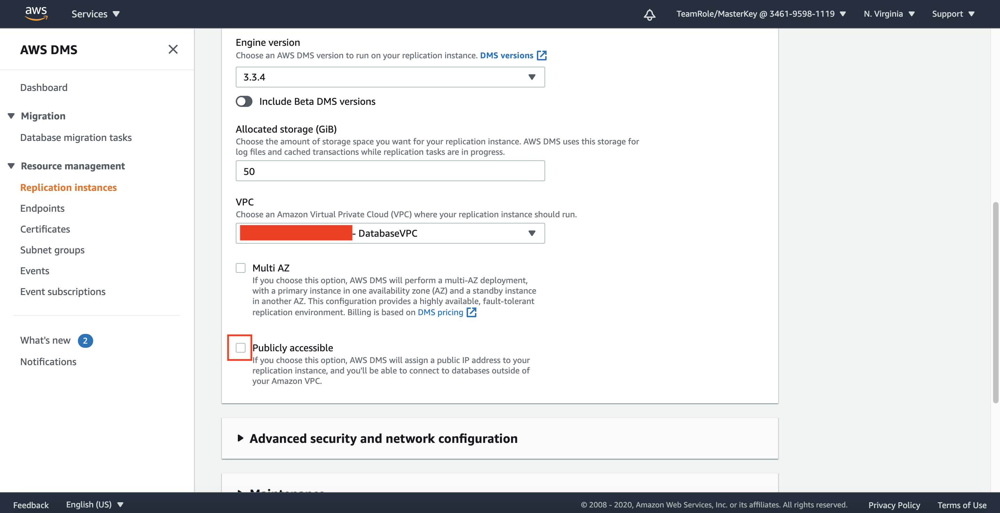
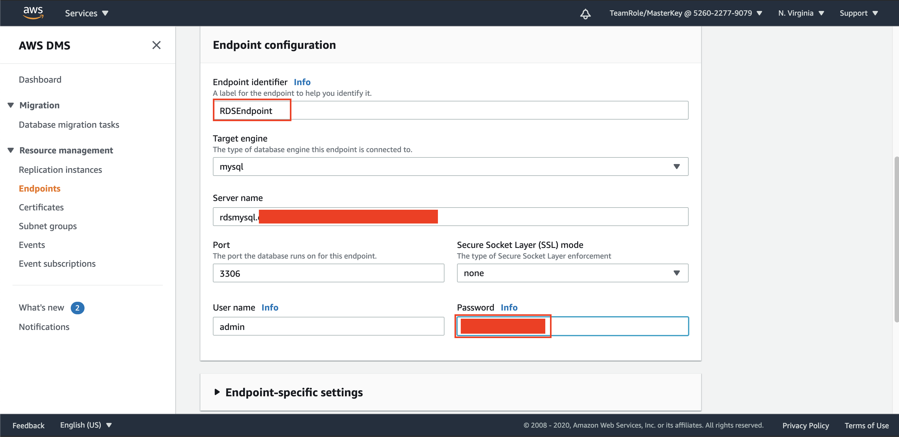

## Migrate the Database

1. Go to [AWS Console](https://console.aws.amazon.com/console/home?region=us-east-1#)
2. Type `DMS` and click the Database Migration Service menu
    
3. Click Replication instances at the left menu
4. Click `Create replication instance`
    
5. Fill the name as `EC2toRDSRepInstance`
6. Fill the description as `Replication Instance from EC2 MySQL to RDS MySQL`
    
7. in VPC Section, choose the VPC you have created (`DatabaseVPC`)
8. make sure you uncheck the `Publicly accessible` on replication instances
    
9. Click `Create` at the bottom page.

It might take few minutes to be ready. wait until the status is `Available`
    

10. Click `Endpoints` at the left menu
11. Click `Create endpoint`
    
12. Click `Source endpoint`
13. In Endpoint identifier, type `EC2Endpoint`
14. In source engine, choose `mysql`
    

We need to get the Public IPv4 DNS of the EC2, which is your database server. Don't close DMS window, we will get back there later.

15. Go to [EC2 Console](https://console.aws.amazon.com/ec2/v2/home?region=us-east-1#) at the other window/tab
16. Click `Instances` at the left menu
17. Click the checkbox of your EC2 instance (`EC2MySQL`)
18. Now, copy the Public IPv4 DNS at the details of your instance.
    

Now, we need to go back to DMS window.

19. Paste your IPv4 DNS at the server name
20. Fill the port into `3306`
21. Fill the username as `testuser`
22. Fill your password that you have set during making database at your server.
    
23. Open `Test endpoint connection` section. We are going to test it before creating it.
24. Choose VPC that you have created (`DatabaseVPC`)
25. Click `Run test`

wait for a while since it will try to connect.

26. The status will change into `successful`
27. Click `Create endpoint`
    

We have created the endpoint from the database server. now, we need to create another endpoint for RDS database.

28. Click `Create endpoint`
29. Click `Target endpoint`
30. Click the checkbox of `Select RDS DB instance`
31. Choose your RDS instance (`rdsmysql`)
    
32. Replace the endpoint identifier as `RDSEndpoint`
33. Fill the password of your RDS Database. You have inputted it during RDS Database creation.
    
34. Go to Test endpoint connection, and select your VPC (`DatabaseVPC`)
35. Click `Run test`

Same as previous, we need to wait for a while.

36. the status will change into `successful`
37. Click `Create endpoint`
    

We have created both endpoints. Now it's time to do the migration.

38. Click `Database migration tasks` at the left menu
39. Click `Create task`
    
40. Fill the task identifier as `EC2toRDSTask`
40. Choose the replication instance you have created (`EC2toRDSRepInstance)
41. Choose the source database endpoint (`EC2Endpoint`)
42. Choose the target database endpoint (`RDSEndpoint`)
43. Choose the migration type as `Migrate existing data and replicate ongoing changes`
    
44. in Task settings section, for CDC stop mode, choose `Don't use custom CDC stop mode`
45. in Target table preparation mode, choose `Do nothing`
46. in Stop task after full load completes, choose `Don't stop`
47. in include LOB columns in replication, choose `Limited LOB mode`
    
48. Click `Enable CloudWatch logs` at Task settings
    
49. In table mappings, click `Add new selection rule`
50. In Schema, choose `Enter a schema`
51. on Schema name, replace the schema name to `classicmodels`
    
52. Click `Create task` at the bottom of the page.

Now, it will automatically migrate the database from EC2 (Database server) to RDS Instance. it will take several minutes to migrate the data.
    

it will change the status into `Running` once the migration is going.

Once it's complete, the status will change into ``

We need to check the database if it's now available on RDS.

53. Open your terminal
54. Type 'mysql -h `your RDS Endpoint` -P 3306 -u admin -p'
55. Type your RDS Password
56. at MySQL interface, type `SHOW DATABASES;`

it will display classicmodels database from EC2 (your database server)
    
    
[BACK TO WORKSHOP GUIDE](../../README.md)