## Setup Your Database Server

1. Go to [AWS Console](https://console.aws.amazon.com/console/home?region=us-east-1#)
2. Type `EC2` and click the EC2 menu
    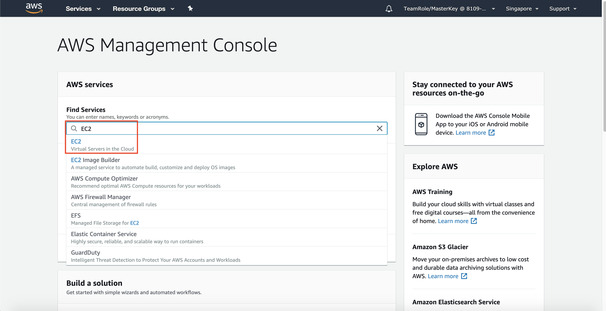
3. Click `Instances` at the left menu
    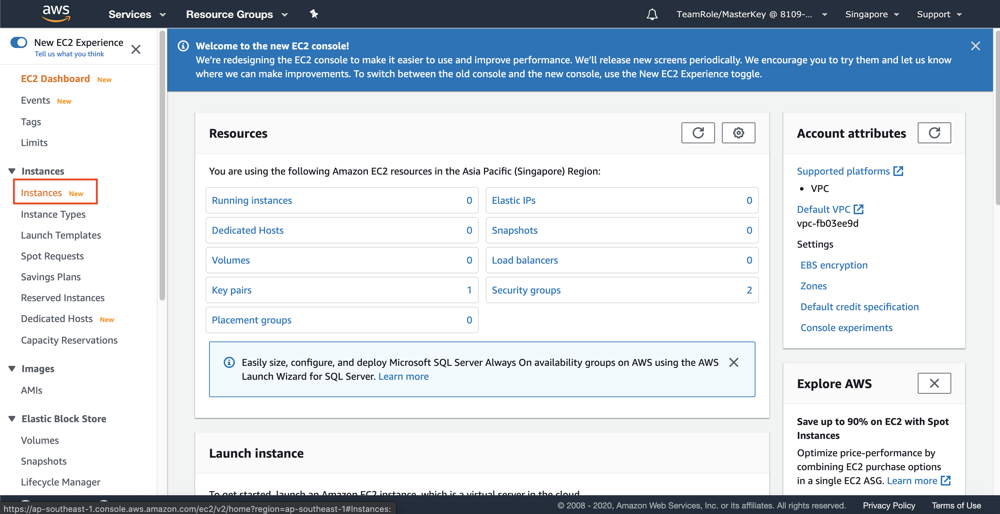
4. Click `Launch instances`
    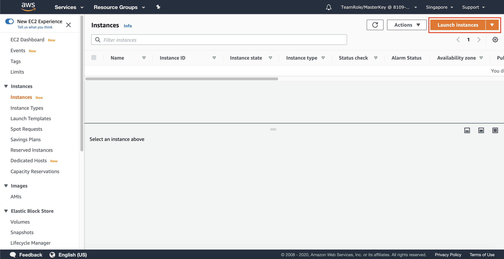
5. Find `Ubuntu Server 18.04 LTS (HVM)` and click `Select`
    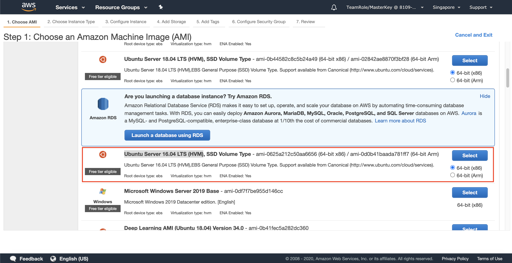
6. Click `Next: Configure Instance Details`
7. In Instance Details page, in Network, choose your previously created VPC (`DatabaseVPC`)
8. in subnet, choose subnet `Public 1`
9. Click `Next: Add Storage`
    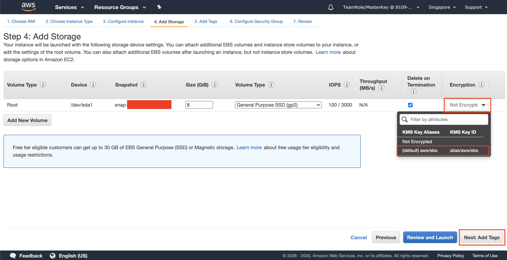
10. On Encryption section, click the dropdown and choose default AWS KMS Key. This is to encrypt the SSD Volume that will be attached to your server.
    
11. Click `Next: Add Tags`
12. Click `Next: Configure Security Group`
13. Change the Security Group name to `EC2MySQLSG`
14. Fill the description as `EC2 MySQL Security Group`
15. Click `Add Rule`
16. at the new row of Type, click `MYSQL/Aurora`
17. at Source, click `My IP`
18. Click `Add Rule`
19. at the new row of Type, click `MYSQL/Aurora`
20. at Source, type `10.0.0.0/16`
21. Click `Review and Launch`
22. Click `Launch`
23. On Key pair menu, choose `Create a new key pair`
24. Fill the Key pair name as `EC2MySQLKey`
25. Click `Download Key Pair`. key pair file will be downloaded through your computer.
26. Click `Launch Instances`
    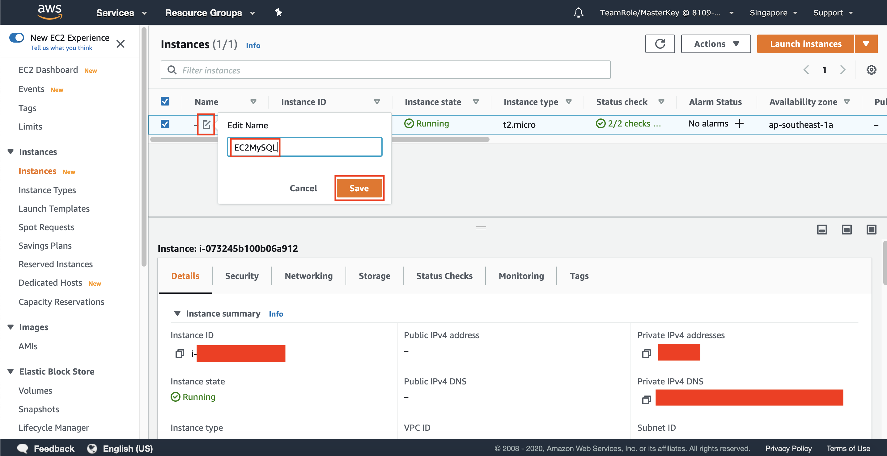
27. Click `View Instances`

It will take few minutes to access your server until your instance state says `Running`
    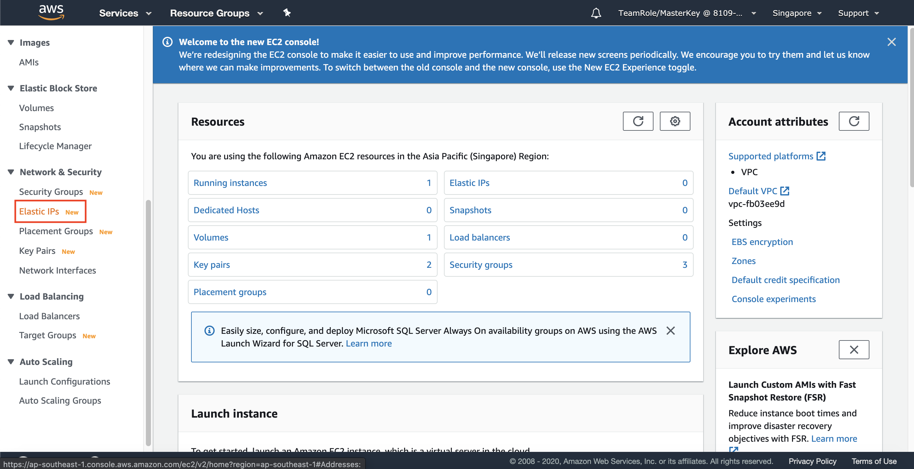

28. At Name Page, click the pencil icon
29. Edit the name and fill it with `EC2MySQL`
30. Click `Save`
    
31. Click `Elastic IP` at Network and Security Section
    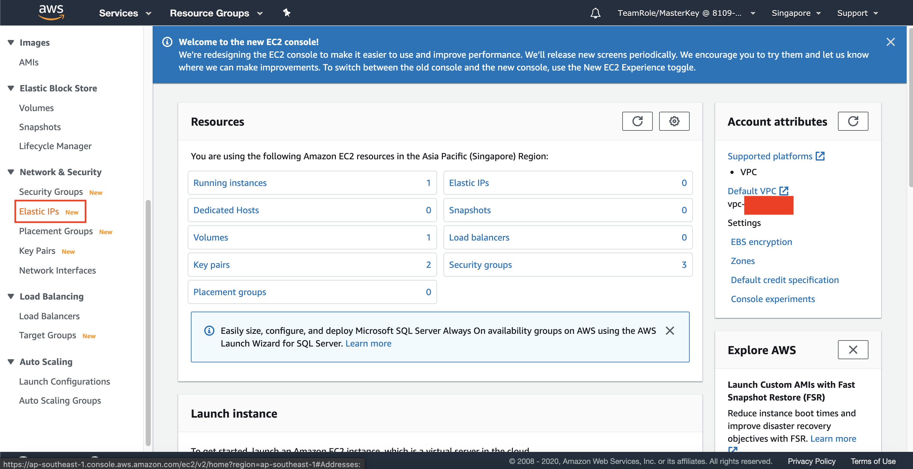
32. Click `Allocate Elastic IP address`
33. Click `Allocate`
34. Check the checkbox of your Elastic IP 
35. Click `Actions` and click `Associate Elastic IP address`
    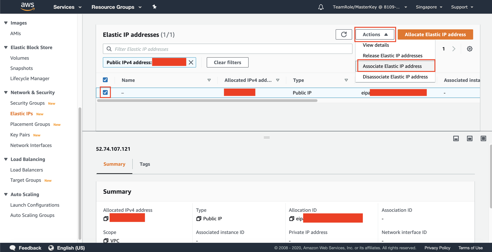

Now, we need to wait until the instance is ready. To know if the instance is ready, check the `Status check` if it says `2/2 checks passed`

36. Choose the instance that you have created (`EC2MySQL`)
37. Choose the private IP address
38. Click `Associate`

this will create the public IP to the instance that you have created.

39. Click `Instance` at the left menu
    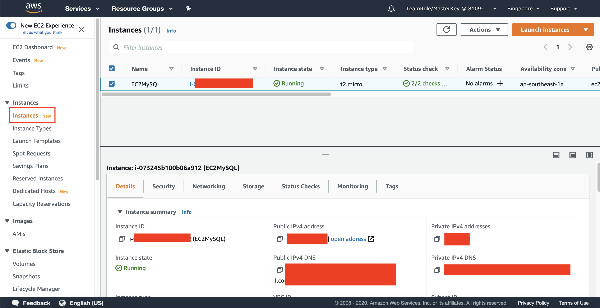
40. Check the checkbox of your instance
41. Click `Actions` and click `Connect`
    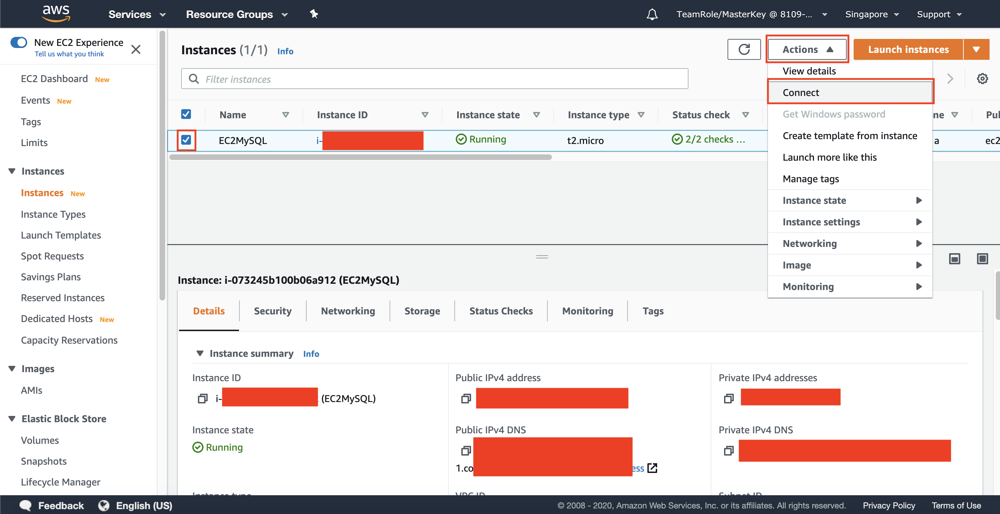
42. Click `SSH client`. it will display the way for you to connect to your instance
43. open your terminal and go to the directory of your Key Pair file (`EC2MySQLKey`)
44. Type `chmod 400 EC2MySQLKey.pem`. This will change the permission of your key file.
45. Type 'ssh -i "EC2MySQLKey.pem" ubuntu@`Public DNS of your instance`'. you can find the public DNS instance at the instance page or just copy the instruction at Connect page.
46. Type `yes` and you will be connected to your instance.

Once you are connected, the display at your terminal will be displayed as below:
    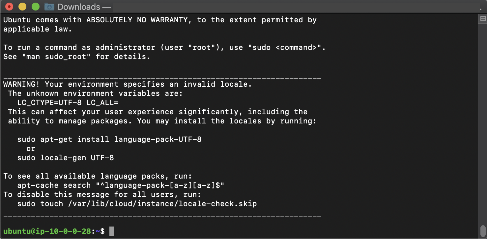

Now, we need to install MySQL at the server

47. Type `sudo apt-get update`. it will update the apt package.
48. type `apt-cache madison mysql-server` to find MySQL version available.

it will display different types of version. We need to choose the 5.7.31 version.

48. Type `sudo apt-get install mysql-server=5.7.31-0ubuntu0.18.04.1`
49. Type `Y` for confirm the installation.

Now, we need to setup the root password.

50. type `sudo mysql_secure_installation`
51. type `y` for validate password plugin
52. type `0` for password validation policy
53. input your root password. Remember it!
54. confirm your password.
55. type `y` for every questions asked.

Once it's done, now you will be able to use MySQL

56. Type `sudo mysql`
it will show mysql interface.
    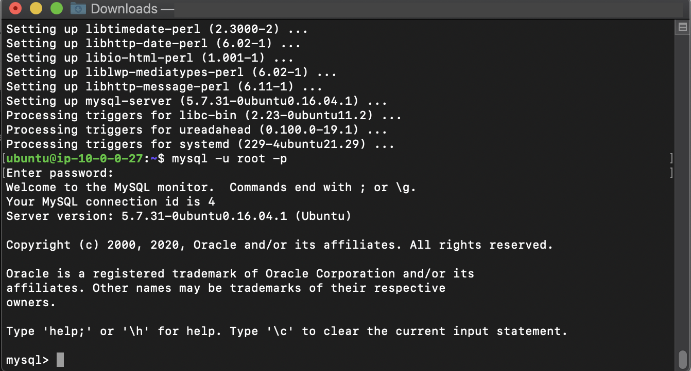

57. Type `exit`

you will be back at your instance. Now, we need to download the sample of the data.

58. Download [this file](../../files/Migration/SetupEC2/mysqlsampledatabase.sql) For database sample creation
59. open the new terminal window. don't close your ubuntu server window

we need to copy from your local into ubuntu server.

60. go to your directory file and make sure your sql file and key file in a same folder.
61. go to [EC2 Console](https://console.aws.amazon.com/ec2/v2/home?region=us-east-1#Home:)
62. click `instances` at the left menu
63. click the checbox at the left side of your instance (`EC2MySQL`)
64. copy the IPv4 public DNS at the below page.
    
65. in the new terminal, type `scp -i EC2MySQLKey.pem mysqlsampledatabase.sql ubuntu@Your-Public-DNS:~/`

Now go to your ubuntu terminal

66. type `ls`

you will see the file is being copied successfully at your server.
    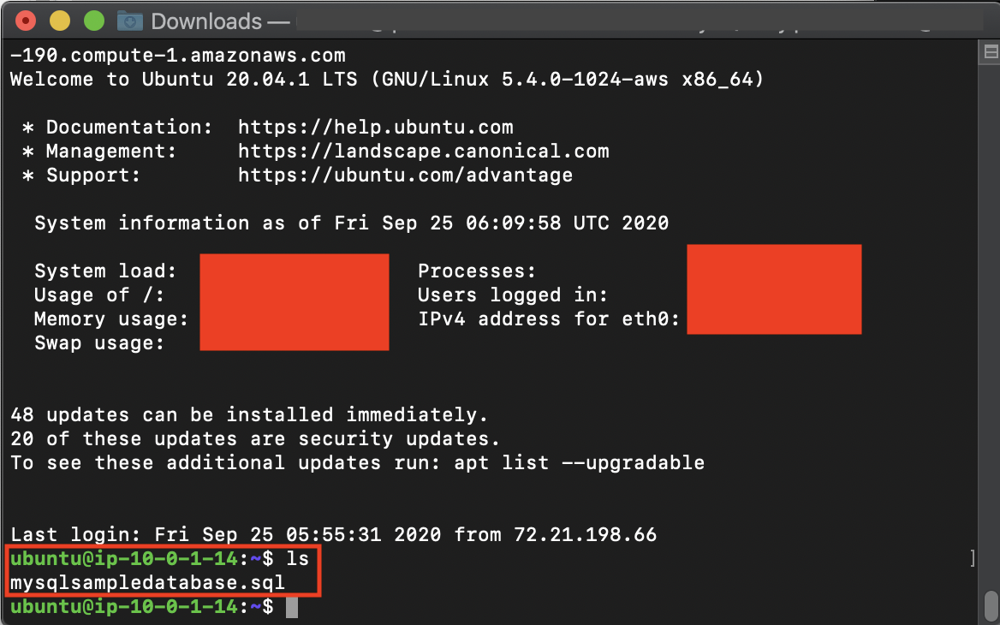

67. Type `sudo mysql < mysqlsampledatabase.sql`

It will execute the creation of database and data. Now, we need to check if the query has been executed.

68. Type `sudo mysql`
69. In SQL Interface, type `SHOW DATABASES;`

You will see `classicmodels` database, which is the dummy database we got from executing the previous query.
    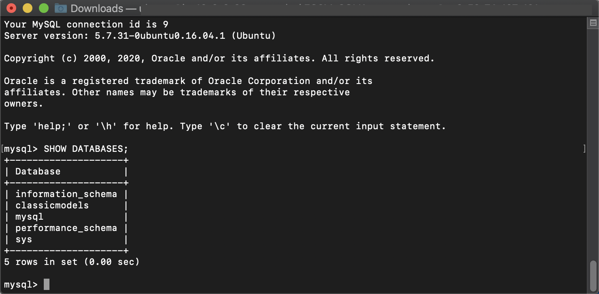

We need to create an user to remotely access the database. This user will be used to migrate the database. Don't forget to change the password in below command "Identified by". Remember the password.

70. Type `CREATE USER 'testuser'@'%' identified by 'your password here';`
71. Type `GRANT ALL ON classicmodels.* to 'testuser';`
72. Type `GRANT REPLICATION SLAVE,REPLICATION CLIENT ON *.* TO 'testuser'@'%';`

Once you have done, we need to open the MySQL to be accessible outside. First, we need to stop the SQL first, configure it, then turn it on again.

73. Type `exit`
74. Type `sudo service mysql stop`
75. Type `cd /etc/mysql/mysql.conf.d`

We need to edit the bind address to allow other processes access to the MySQL

76. Type `sudo vim mysqld.cnf`

it will display the configuration file of your MySQL.

77. Type `i` at your keyboard.
78. Find `bind-address` and change it from `127.0.0.1` to `0.0.0.0`

Another thing, we need to turn on the binary log and server id. This binary log will be used to migrate the data we have.

79. find `#server-id = 1` and remove the `#`
80. find `#log_bin = ...` and remove the `#`
81. find `# binlog_do_db = ...` and remove the `#`
82. replace the db name into `classicmodels`
    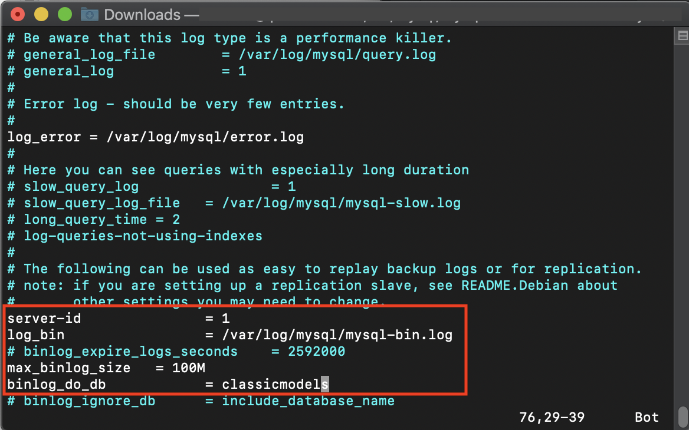
83. Type escape (esc) at your keyboard
84. Type `:wq!`

it will save and quit the text editor. We need to run the MySQL again.

85. Type `sudo service mysql start`

Now, we need to check if the binary logs has been enabled though testuser account.

86. Type `mysql -u testuser -p`
87. Input your testuser password in step 68.
88. In MySQL Interface, type `SHOW BINARY LOGS;`

It will display the binary logs table at the query result.
    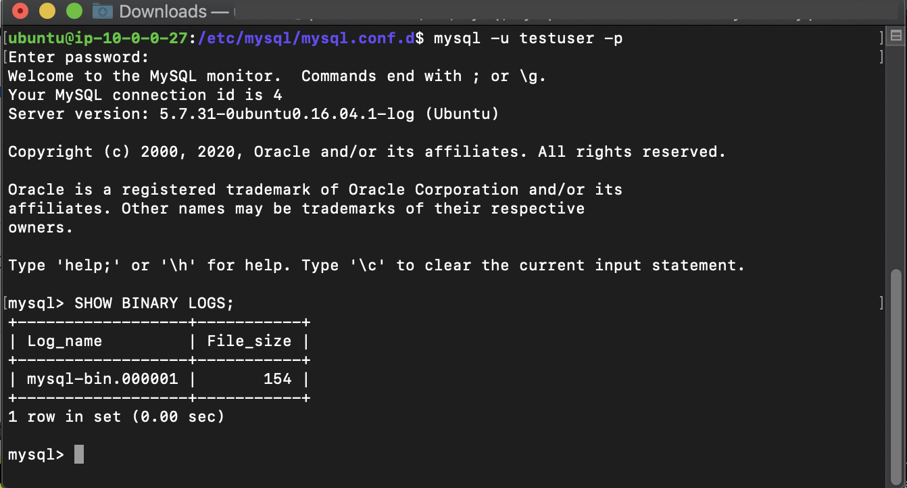

Now, We need to try the connection.

89. Type `exit`
90. Type `exit` again.

it will come back to your terminal and the connection of your instance is being closed.

We need to try to access the MySQL remotely.

91. go to your [EC2 console here](https://console.aws.amazon.com/ec2/v2/home?region=us-east-1#)
92. find your instance (EC2MySQL) and copy the Public IPv4 DNS
   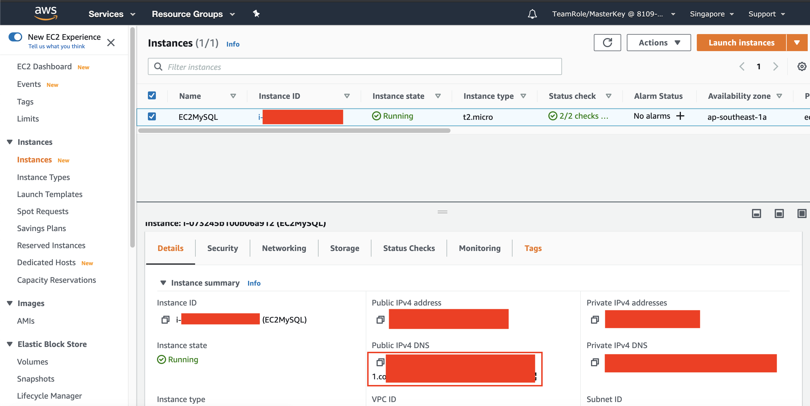
93. in your regular terminal, type 'mysql -h `your public IPv4 DNS` -P 3306 -u testuser -p'
94. Type your password

it will be connected to your MySQL at the server. Now, let's see the database.

95. In MySQL interface, type `SHOW DATABASES;`
    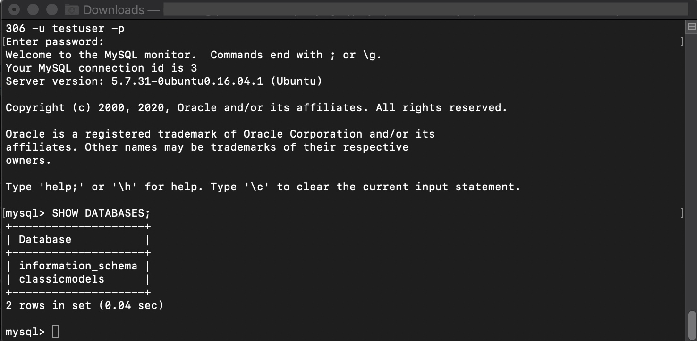
96. Type `exit`.

[BACK TO WORKSHOP GUIDE](../../README.md)