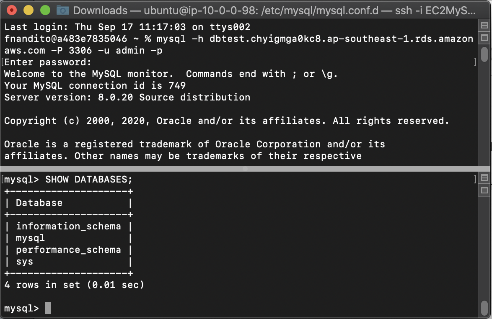
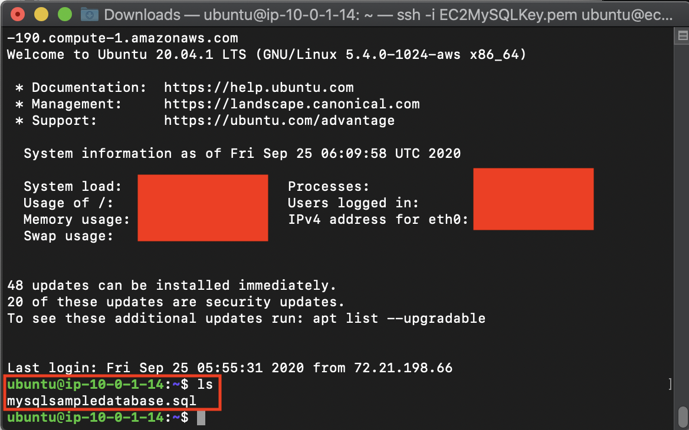
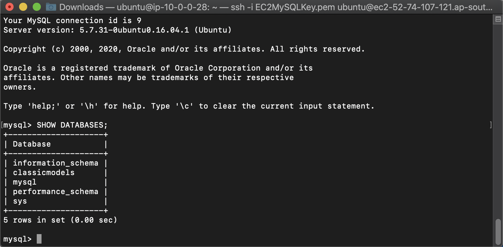
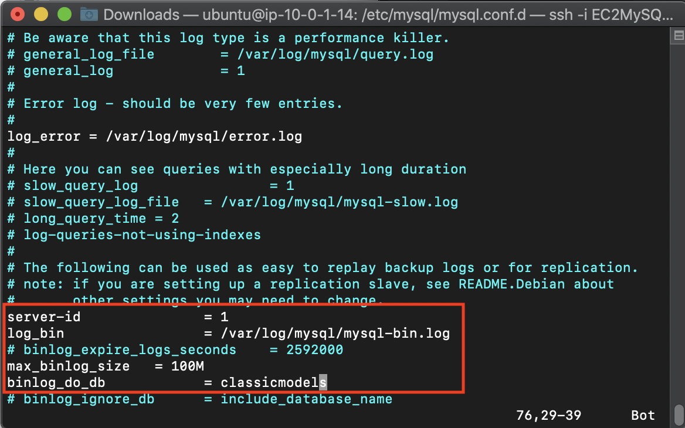
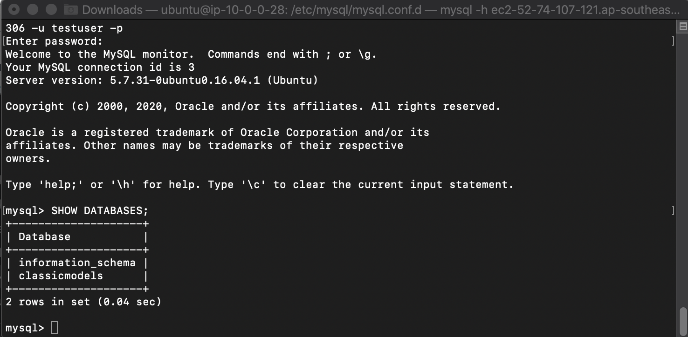

## Setup Your Database Server

1. Go to [AWS Console](https://console.aws.amazon.com/console/home?region=us-east-1#)
2. Type `EC2` and click the EC2 menu
    
3. Click `Instances` at the left menu
    
4. Click `Launch instances`
    
5. Find `Ubuntu Server 20.04 LTS (HVM)` and click `Select`
    
6. Click `Next: Configure Instance Details`
7. In Instance Details page, in Network, choose your previously created VPC (`DatabaseVPC`)
8. Click `Next: Add Storage`
    
9. On Encryption section, click the dropdown and choose default AWS KMS Key. This is to encrypt the SSD Volume that will be attached to your server.
    
10. Click `Next: Add Tags`
11. Click `Next: Configure Security Group`
12. Change the Security Group name to `EC2MySQLSG`
13. Fill the description as `EC2 MySQL Security Group`
14. Click `Add Rule`
15. at the new row of Type, click `MYSQL/Aurora`
16. at Source, click `My IP`
17. Click `Review and Launch`
18. Click `Launch`
19. On Key pair menu, choose `Create a new key pair`
20. Fill the Key pair name as `EC2MySQLKey`
21. Click `Download Key Pair`. key pair file will be downloaded through your computer.
22. Click `Launch Instances`
    
23. Click `View Instances`
It will take few minutes to access your server until your instance state says `Running`
    

24. At Name Page, click the pencil icon
25. Edit the name and fill it with `EC2MySQL`
26. Click `Save`
    
27. Click `Elastic IP` at Network and Security Section
    
28. Click `Allocate Elastic IP address`
29. Click `Allocate`
30. Check the checkbox of your Elastic IP 
31. Click `Actions` and click `Associate Elastic IP address`
    
32. Choose the instance that you have created (`EC2MySQL`)
33. Choose the private IP address
34. Click `Associate`
this will create the public IP to the instance that you have created.

35. Click `Instance` at the left menu
    
36. Check the checkbox of your instance
37. Click `Actions` and click `Connect`
    
38. Click `SSH client`. it will display the way for you to connect to your instance
39. open your terminal and go to the directory of your Key Pair file (`EC2MySQLKey`)
40. Type `chmod 400 EC2MySQLKey.pem`. This will change the permission of your key file.
41. Type 'ssh -i "EC2MySQLKey.pem" ubuntu@`Public DNS of your instance`'. you can find the public DNS instance at the instance page or just copy the instruction at Connect page.

42. Type `yes` and you will be connected to your instance.

Once you are connected, the display at your terminal will be displayed as below:
    

Now, we need to install MySQL at the server

43. Type `sudo apt-get update`. it will update the apt package.
44. Type `sudo apt-get install mysql-server`

Now, you need to configure the root account password

45. Type `sudo mysql_secure_installation`
46. Type `y`
47. There will be a password validation policy, type `0` for the low password policy
48. Type your password and re-enter your password
49. Keep typing `y` for every single question asked, until the process is done.

Once it's done, now you will be able to use MySQL

50. Type `sudo mysql`

it will show mysql interface.
    

51. Type `exit`

you will be back at your instance. Now, we need to download the sample of the data.

52. Download [this file](../../files/Migration/SetupEC2/mysqlsampledatabase.sql) For database sample creation
53. open the other terminal window

we need to copy from your local into ubuntu server.

54. go to your directory file and make sure your sql file and key file in a same folder.
55. go to [EC2 Console](https://console.aws.amazon.com/ec2/v2/home?region=us-east-1#Home:)
56. click `instances` at the left menu
57. click the checbox at the left side of your instance (`EC2MySQL`)
58. copy the public DNS at the below page.
59. in the new terminal, type `scp -i EC2MySQLKey.pem mysqlsampledatabase.sql ubuntu@Your-Public-DNS:~/`

Now go to your ubuntu terminal

60. type `ls`

you will see the file is being copied successfully at your server.
    

61. Type `sudo mysql < mysqlsampledatabase.sql`

It will execute the creation of database and data. Now, we need to check if the query has been executed.

62. Type `sudo mysql`
63. In SQL Interface, type `SHOW DATABASES;`

You will see `classicmodels` database, which is the dummy database we got from executing the previous query.
    

We need to create an user to remotely access the database. This user will be used to migrate the database.

64. Type `CREATE USER 'testuser'@'%' identified by 'your password here';`
65. Type `GRANT ALL ON classicmodels.* to 'testuser';`

Once you have done, we need to open the MySQL to be accessible outside. First, we need to stop the SQL first, configure it, then turn it on again.

66. Type `exit`
67. Type `sudo service mysql stop`
68. Type `cd /etc/mysql/mysql.conf.d`

We need to edit the bind address to allow other processes access to the MySQL

69. Type `sudo vim mysqld.cnf`

it will display the configuration of the MySQL.

70. Type `i`
71. Find `bind-address` and change it from `127.0.0.1` to `0.0.0.0`

Another thing, we need to turn on the log bin and server id. This will become handy in migration step later.

72. find `#server-id = 1` and remove the `#`
73. find `#log_bin = ...` and remove the `#`
74. find `# binlog_do_db = ...` and remove the `#`
75. replace the db name into `classicmodels`
    
76. Type escape (esc) at your keyboard
77. Type `:wq`

it will save and quit the text editor. We need to run the MySQL again.

78. Type `sudo service mysql start`

We need to try the connection.

79. Type `exit`

it will come back to your terminal and the connection of your instance is being closed.

We need to try to access the MySQL remotely.

80. go to your [EC2 console here](https://console.aws.amazon.com/ec2/v2/home?region=us-east-1#)
81. find your instance (EC2MySQL) and copy the Public IPv4 DNS
    
82. in your regular terminal, type 'mysql -h `your public IPv4 DNS` -P 3306 -u testuser -p'
83. Type your password
    

it will be connected to your MySQL at the server.

84. Type `exit`.

[BACK TO WORKSHOP GUIDE](../../README.md)