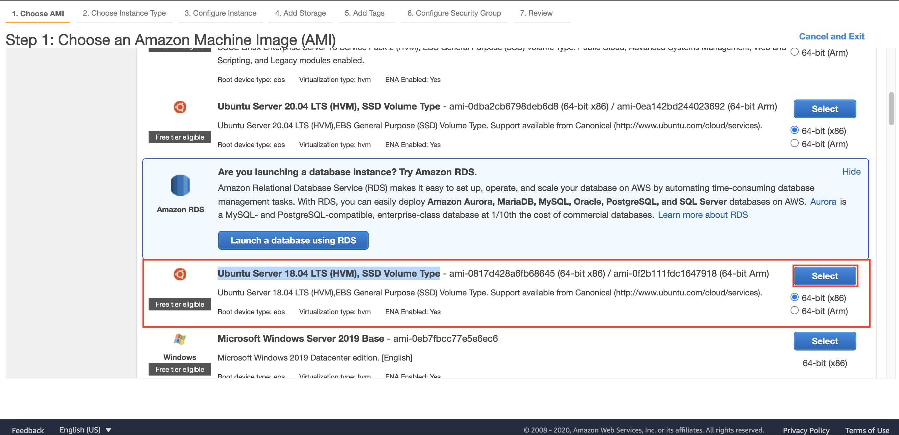
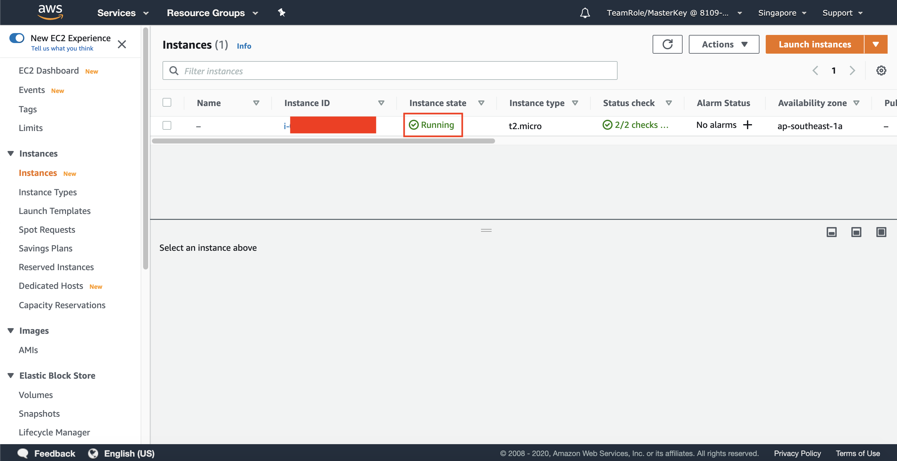

## Setup Your Database Server

1. Go to [AWS Console](https://console.aws.amazon.com/console/home?region=us-east-1#)
2. Type `EC2` and click the EC2 menu
    
3. Click `Instances` at the left menu
    
4. Click `Launch instances`
    
5. Find `Ubuntu Server 16.04 LTS (HVM)` and click `Select`
    
6. Click `Next: Configure Instance Details`
7. In Instance Details page, in Network, choose your previously created VPC (`DatabaseVPC`)
8. Click `Next: Add Storage`
    
9. On Encryption section, click the dropdown and choose default AWS KMS Key. This is to encrypt the SSD Volume that will be attached to your server.
    
10. Click `Next: Add Tags`
11. Click `Next: Configure Security Group`
12. Change the Security Group name to `EC2MySQLSG`
13. Fill the description as `EC2 MySQL Security Group`
14. Click `Add Rule`
15. at the new row of Type, click `MYSQL/Aurora`
16. at Source, click `Anywhere`
17. Click `Review and Launch`
    
18. Click `Launch`
19. On Key pair menu, choose `Create a new key pair`
20. Fill the Key pair name as `EC2MySQLKey`
21. Click `Download Key Pair`. key pair file will be downloaded through your computer.
22. Click `Launch Instances`
    
23. Click `View Instances`
It will take few minutes to access your server until your instance state says `Running`
    

24. At Name Page, click the pencil icon
25. Edit the name and fill it with `EC2MySQL`
26. Click `Save`
    
27. Click `Elastic IP` at Network and Security Section
    
28. Click `Allocate Elastic IP address`
29. Click `Allocate`
30. Check the checkbox of your Elastic IP 
31. Click `Actions` and click `Associate Elastic IP address`
    
32. Choose the instance that you have created (`EC2MySQL`)
33. Choose the private IP address
34. Click `Associate`
this will create the public IP to the instance that you have created.

35. Click `Instance` at the left menu
    
36. Check the checkbox of your instance
37. Click `Actions` and click `Connect`
    
38. Click `SSH client`. it will display the way for you to connect to your instance
39. open your terminal and go to the directory of your Key Pair file (`EC2MySQLKey`)
40. Type `chmod 400 EC2MySQLKey.pem`. This will change the permission of your key file.
41. Type 'ssh -i "EC2MySQLKey.pem" ubuntu@`Public DNS of your instance`'. you can find the public DNS instance at the instance page or just copy the instruction at Connect page.

42. Type `yes` and you will be connected to your instance.

Once you are connected, the display at your terminal will be displayed as below:
    

Now, we need to install MySQL at the server

43. Type `sudo apt-get update`. it will update the apt package.
44. Type `sudo apt-get install mysql-server`
45. Type `Y`
46. Input the password for your root user.
47. Confirm your password.

Once it's done, now you will be able to use MySQL

48. Type `mysql -u root -p`
49. Input your password you have previously inputted.

it will show mysql interface.
    

50. Type `exit`

you will be back at your instance. Now, we need to download the sample of the data.

51. Type `wget https://sp.mysqltutorial.org/wp-content/uploads/2018/03/mysqlsampledatabase.zip`
52. Type `ls` it will display the sample data in your server.

We need to install the unzip package to unzip the file we have downloaded.
    

53. Type `sudo apt install unzip`
54. Type `Y`

The zip package will be installed at your server. Once it's done, we need to decompress the zip file

55. Type `unzip mysqlsampledatabase.zip`
56. Type `ls`

It will display 2 files, the sql file and zip file. We need to execute the SQL file.
    

57. Type `mysql -u root -p < mysqlsampledatabase.sql`
58. Type your root password

It will execute the creation of database and data. Now, we need to check if the query has been executed.

59. Type `mysql -u root -p`
60. Type your root password.
61. In SQL Interface, type `SHOW DATABASES;`

You will see `classicmodels` database, which is the dummy database we got from executing the previous query.
    

We need to create an user to remotely access the database. This user will be used to migrate the database.

62. Type `CREATE USER 'testuser'@'%' identified by 'your password here';`
63. Type `GRANT ALL ON classicmodels.* to 'testuser';`

Once you have done, we need to open the MySQL to be accessible outside. First, we need to stop the SQL first, configure it, then turn it on again.

64. Type `exit`
65. Type `sudo service mysql stop`
66. Type `cd /etc/mysql/mysql.conf.d`

We need to edit the bind address to allow other processes access to the MySQL

67. Type `sudo vim mysqld.cnf`

it will display the configuration of the MySQL.

68. Type `i`
68. Find `bind-address` and change it from `127.0.0.1` to `0.0.0.0`

Another thing, we need to turn on the log bin and server id. This will become handy in migration step later.
69. find `#server-id = 1` and remove the `#`
70. find `#log_bin = ...` and remove the `#`
    
71. Type escape (esc) at your keyboard
72. Type `:wq`

it will save and quit the text editor. We need to run the MySQL again.

73. Type `sudo service mysql start`

We need to try the connection.

74. Type `exit`

it will come back to your terminal and the connection of your instance is being closed.

We need to try to access the MySQL remotely.

75. go to your [EC2 console here](https://console.aws.amazon.com/ec2/v2/home?region=us-east-1#)
76. find your instance (EC2MySQL) and copy the Public IPv4 DNS
    
77. in your regular terminal, type 'mysql -h `your public IPv4 DNS` -P 3306 -u testuser -p'
78. Type your password
    

it will be connected to your MySQL at the server.

[BACK TO WORKSHOP GUIDE](../../README.md)