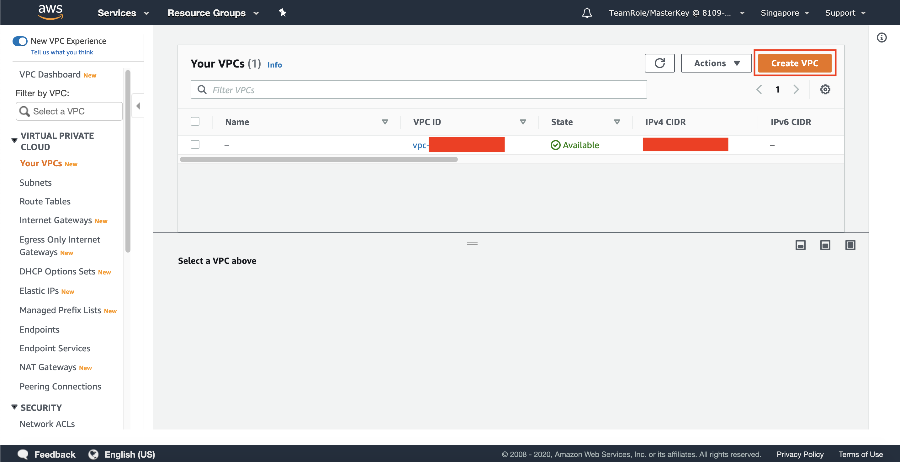
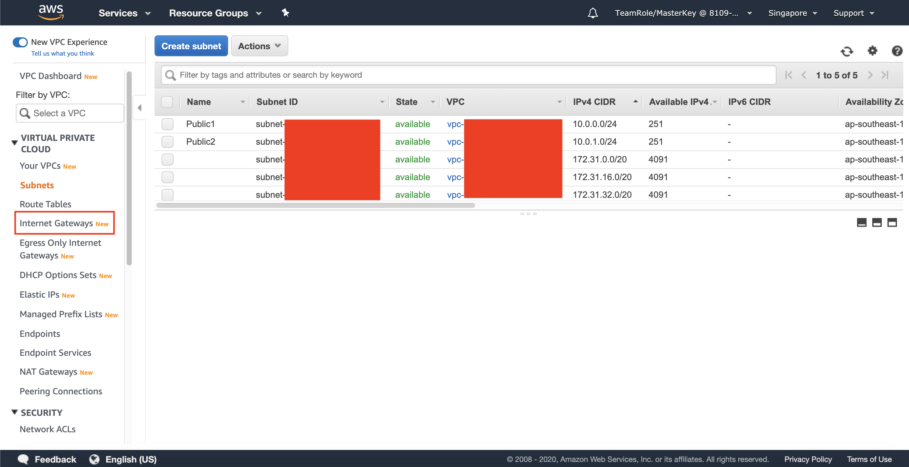
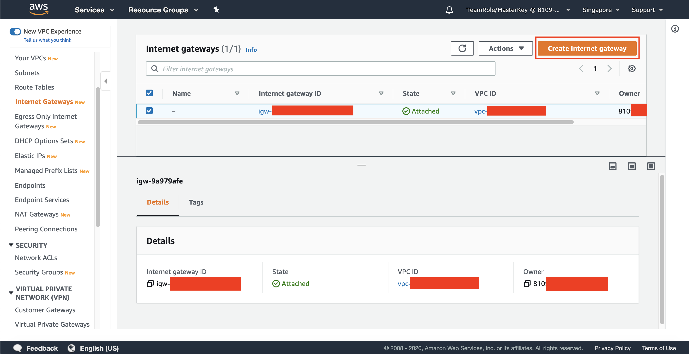
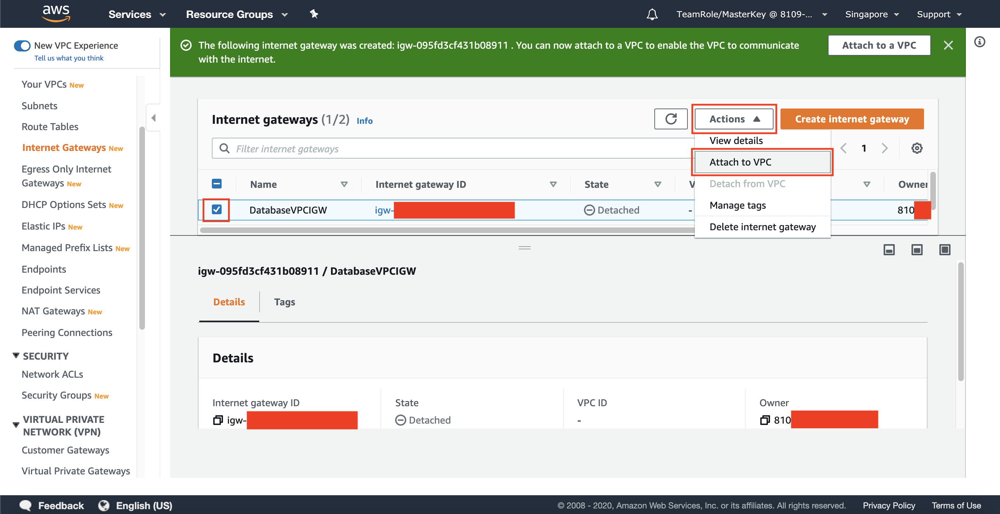

## Setup Networking on AWS

1. Go to [AWS Console](https://console.aws.amazon.com/console/home?region=us-east-1#)
2. Type `VPC` on the textbox and click the VPC menu
    
3. Click `Your VPCs` at the left side of the menu
    
4. Click `Create VPC`
    
5. Fill the Name Tag as `DatabaseVPC`
6. Fill the IPv4 CIDR block as `10.0.0.0/16`
7. Click `Create VPC` button
    
8. On the left menu, click `Subnets`
    
9. Click `Create Subnet`
    
10. Fill the Name Tag as `Public1`
11. Choose the previous VPC that has been created (`DatabaseVPC`)
12. Choose Availability Zone as `us-east-1a`
13. Fill 1Pv4 CIDR block as `10.0.0.0/24`
    
14. Click `Create`
15. Click `Close`
16. Click `Create Subnet`
17. Fill the Name Tag as `Public2`
18. Choose the previous VPC that has been created (`DatabaseVPC`)
19. Choose Availability Zone as `us-east-1b`
20. Fill 1Pv4 CIDR block as `10.0.1.0/24`
    
21. Click `Create`
22. Click `Close`
23. Click `Internet Gateways` at the left menu
    
24. Click `Create internet gateway`
    
25. Fill the Name tag `DatabaseVPCIGW`
26. Click `Create internet gateway`
27. Click `Internet Gateways` at the left menu
28. Check the checkbox of your internet gatway you have created
29. Click `Actions` and click `Attach to VPC`
    
30. Choose the VPC you have previously made (`DatabaseVPC`)
31. Click `Attach internet gateway`
32. Click `Your VPCs` at the left menu
33. Check the checkbox of your VPC you have created
34. Click `Actions` and click `Edit DNS hostnames`
    
35. Check DNS hostnames to `Enable`
36. Click `Save Changes`
37. Click `Route Tables` on the left menu
    
38. Choose the Route Table that contains your VPC (`DatabaseVPC`)
    
39. In menu below, click `Routes` and click `Edit routes`
    
40. Click `Add route`
41. Fill the destination of `0.0.0.0/0`
42. on Target, choose `Internet Gateway`
43. Pick your Internet Gateway (`DatabaseVPCIGW`)
    
44. Click `Save routes`
45. Click `Close`

[BACK TO WORKSHOP GUIDE](../../README.md)