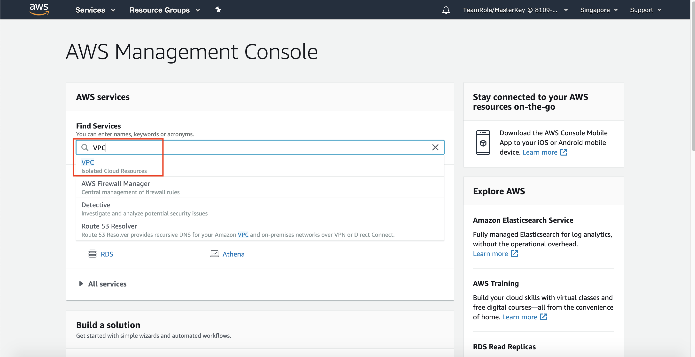
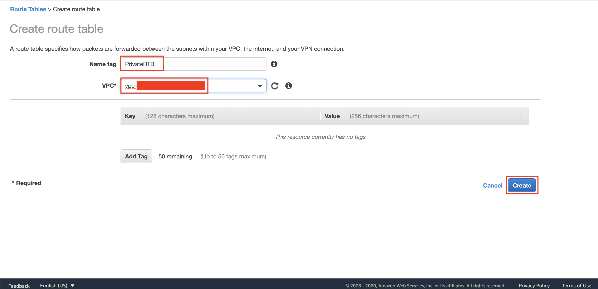
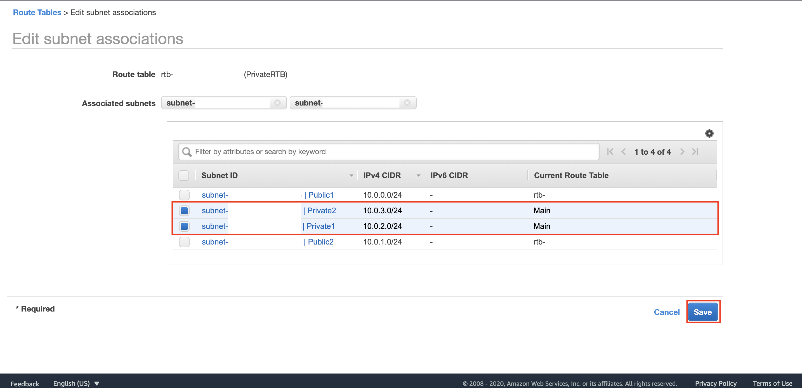

## Setup Networking on AWS

1. Go to [AWS Console](https://console.aws.amazon.com/console/home?region=us-east-1#)
2. Type `VPC` on the textbox and click the VPC menu
    
3. Click `Your VPCs` at the left side of the menu
    
4. Click `Create VPC`
    
5. Fill the Name Tag as `DatabaseVPC`
6. Fill the IPv4 CIDR block as `10.0.0.0/16`
7. Click `Create VPC` button
    
8. On the left menu, click `Subnets`
    
9. Click `Create Subnet`
    
10. Fill the Name Tag as `Public1`
11. Choose the previous VPC that has been created (`DatabaseVPC`)
12. Choose Availability Zone as `us-east-1a`
13. Fill 1Pv4 CIDR block as `10.0.0.0/24`
    
14. Click `Create`
15. Click `Close`
16. Click `Create Subnet`
17. Fill the Name Tag as `Public2`
18. Choose the previous VPC that has been created (`DatabaseVPC`)
19. Choose Availability Zone as `us-east-1b`
20. Fill 1Pv4 CIDR block as `10.0.1.0/24`
    
21. Click `Create`
22. Click `Close`

Please repeat the step for private subnets

23. Click `Create Subnet`
24. Fill the Name Tag as `Private1`
25. Choose the previous VPC that has been created (`DatabaseVPC`)
26. Choose Availability Zone as `us-east-1c`
27. Fill 1Pv4 CIDR block as `10.0.2.0/24`
28. Click `Create`
29. Click `Close`
30. Click `Create Subnet`
31. Fill the Name Tag as `Private2`
32. Choose the previous VPC that has been created (`DatabaseVPC`)
33. Choose Availability Zone as `us-east-1d`
34. Fill 1Pv4 CIDR block as `10.0.3.0/24`
35. Click `Create`
36. Click `Close`

Now, we need to create Internet gateway to access the instances at the public subnets to the internet.

37. Click `Internet Gateways` at the left menu
    
38. Click `Create internet gateway`
    
39. Fill the Name tag `DatabaseVPCIGW`
40. Click `Create internet gateway`
41. Click `Internet Gateways` at the left menu
42. Check the checkbox of your internet gatway you have created
43. Click `Actions` and click `Attach to VPC`
    
44. Choose the VPC you have previously made (`DatabaseVPC`)
45. Click `Attach internet gateway`
46. Click `Your VPCs` at the left menu
47. Check the checkbox of your VPC you have created
48. Click `Actions` and click `Edit DNS hostnames`
    
49. Check DNS hostnames to `Enable`
50. Click `Save Changes`

Change the route table for the connection to public internet

51. Click `Route Tables` on the left menu
    
52. Choose the Route Table that contains your VPC (`DatabaseVPC`)
    
53. In menu below, click `Routes` and click `Edit routes`
    
54. Click `Add route`
55. Fill the destination of `0.0.0.0/0`
56. on Target, choose `Internet Gateway`
57. Pick your Internet Gateway (`DatabaseVPCIGW`)
    
58. Click `Save routes`
59. Click `Close`

Now, we need to create a connection in a private subnets.

60. click `NAT Gateways` at the left menu.
61. click `Create NAT gateway`
    
62. in name, type `DatabaseVPCNATGW`
63. in subnet, choose subnet `Public1`
64. click `Allocate Elastic IP`
    
65. click `Create NAT Gateway`

After that, we need to wait for a moment, since NAT Gateway will be in `Pending` State

Once it's done, it will be in `Available` State.
    

66. click `Route Table` at the left menu
67. click the left box at the route table you have.
    
68. hover and click to the pencil logo
69. type `PublicRTB`
    
70. click check button.

It will change the name of the public Route table you have.

Now, we need to create a new connection for the Private subnet.

71. click `Create route table`
72. in name field, click `PrivateRTB`
73. in VPC, choose your VPC (`DatabaseVPC`)
74. click `Create`
    
75. click `Close`
76. choose `PrivateRTB` checkbox
77. click `Routes` tab
78. click `Edit routes`
    
79. click `Add route`
80. in destination, type `0.0.0.0/0`
81. in target, choose `NAT Gateway` and choose your NAT Gateway (`DatabaseVPCNATGW`)
82. click `Save routes`
    
83. click `Close`

Now, we need to assign which subnet has a public and which subnet has a private connection.

84. click `PublicRTB` checkbox
85. click `Subnet Associations`
86. click `Edit subnet associations`
    
87. in subnet associations page, choose `Public1` and `Public2`
88. click `Save`
    
89. click `PrivateRTB` checkbox
90. click `Subnet Associations`
91. click `Edit subnet associations`
    
92. in subnet associations page, choose `Private1` and `Private2`
93. click `Save`
    

[BACK TO WORKSHOP GUIDE](../../README.md)