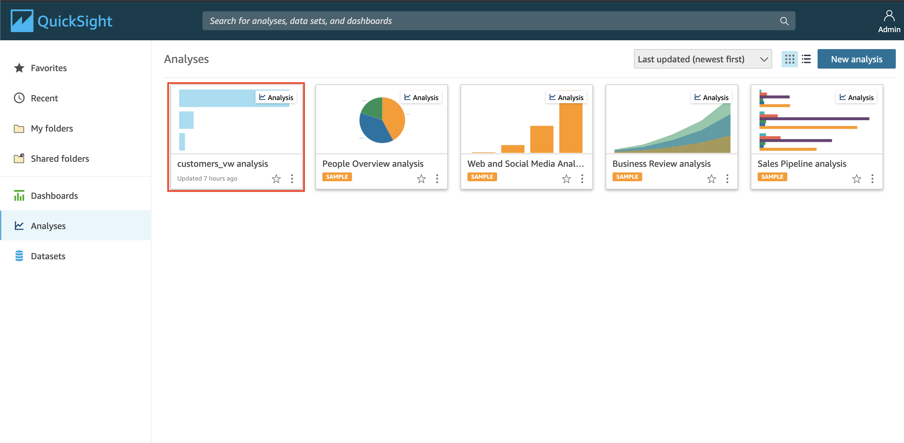
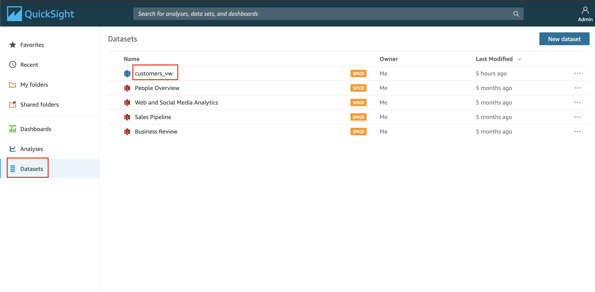
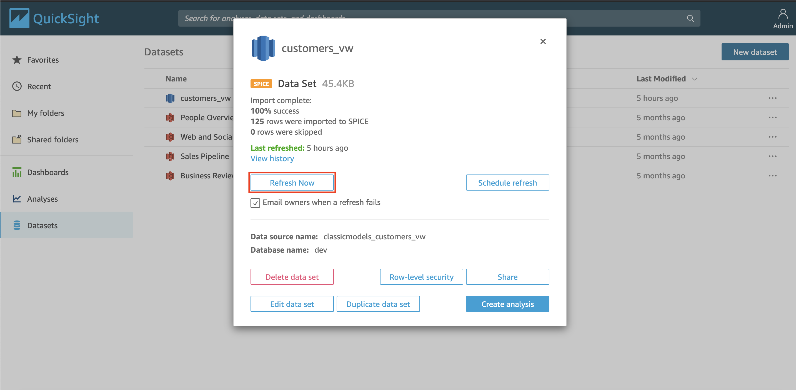
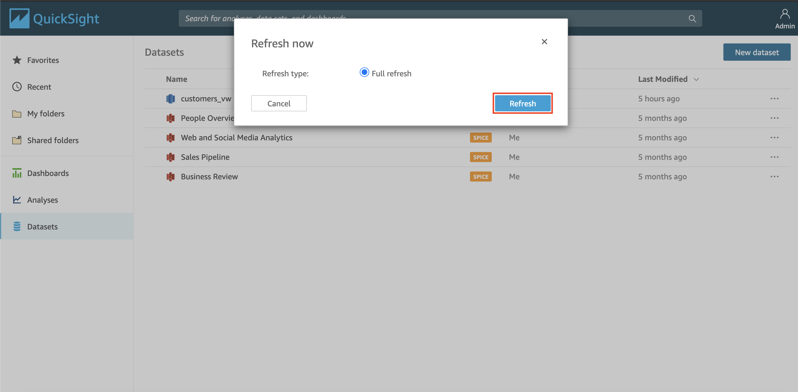
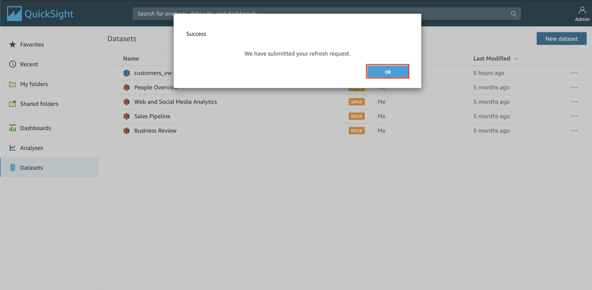
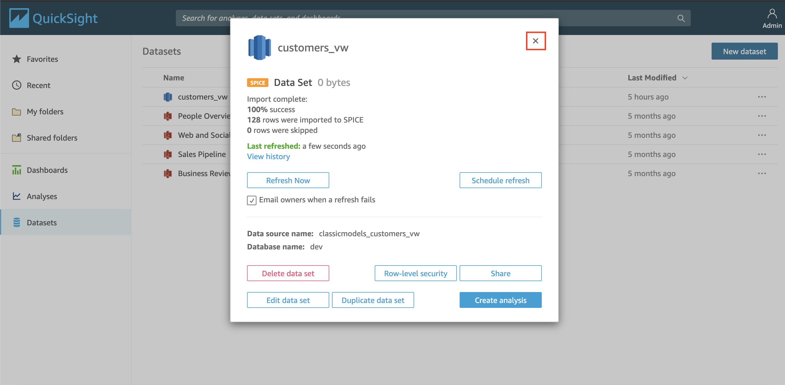
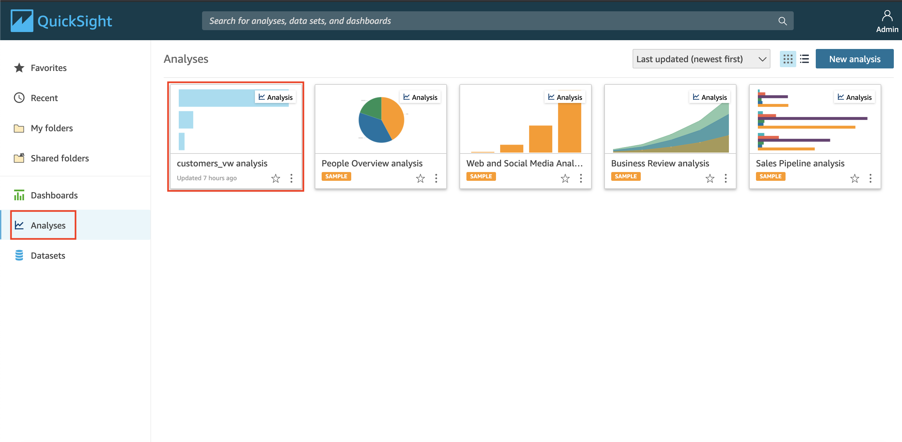
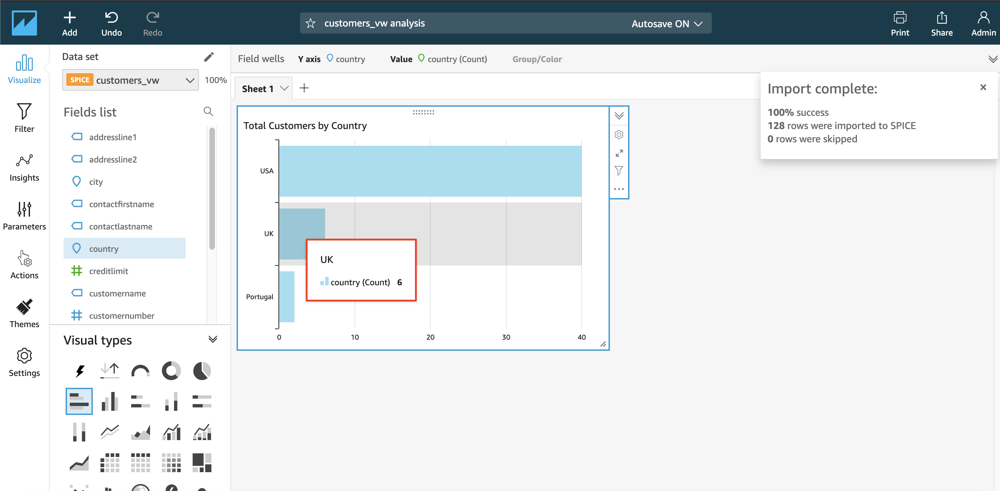

## Check Data Visualization

Once the ETL job has been processed, now check if your data in QuickSight and see if there is some changes there.

1. go to [QuickSight Console](https://us-east-1.quicksight.aws.amazon.com/sn/start)
2. click `customers_vw analysis` in Analyses group
    
3. if you see, the total of USA customers are 36, UK customers will be 5, and Portugal will be 2. Just Hover the bar chart
    

The actual total customer should be 38 customers for USA, 6 for UK, and 2 for portugal. this mismatch happen because the QuickSight dataset haven't been refreshed.

We need to refresh it.

4. click quicksight logo at the top left
    
5. click `Datasets` at the left menu
6. click `customers_vw` datasets
    
7. click `Refresh now`
    
8. click `Refresh`
    

the data will then be refreshed automatically.

9. click `Ok`
    
10. click `x` button at the top right of the customer_vw datasets description
    
11. click `Analyses` at the left menu
12. click `customers_vw analysis`
    

The data will then change based on the actual data
    

[BACK TO WORKSHOP GUIDE](../../README.md)