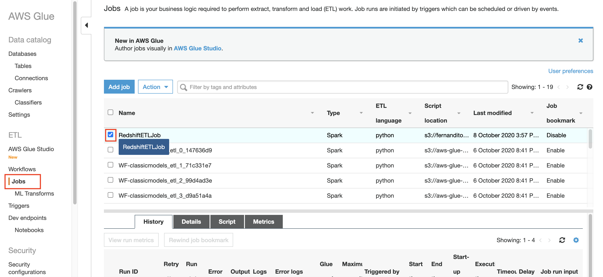
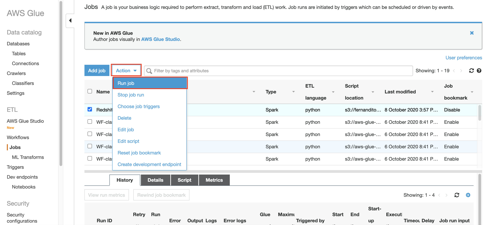
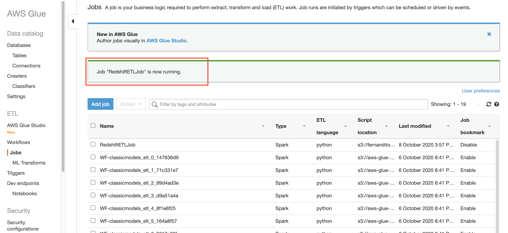
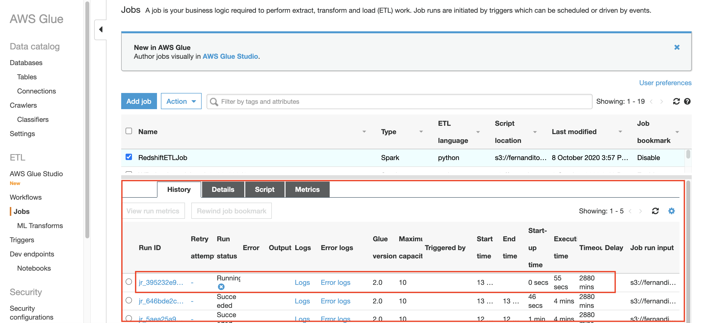
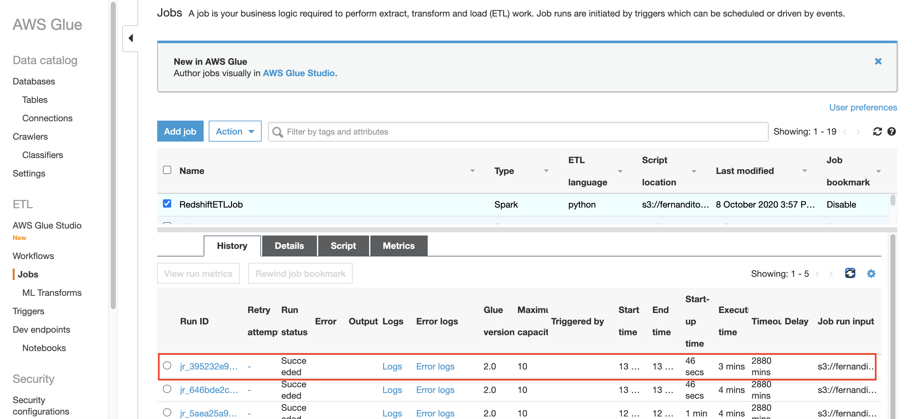

## Run ETL Job

After your data is going to be integrated from database to datalake, now it's time to run ETL job from your data lake to your data warehouse.

1. go to [Glue console](https://console.aws.amazon.com/glue/home?region=us-east-1)
2. click `Jobs` at the left menu
3. click the checkbox at `RedshiftETLJob`
    
4. click `Action` and click `Run Job`
    

it will take few minutes to run the job.
    

to check if the job is still running, check the `History` tab
    

Once it's done, it will change the run status as `Succeeded`
    

[BACK TO WORKSHOP GUIDE](../../README.md)