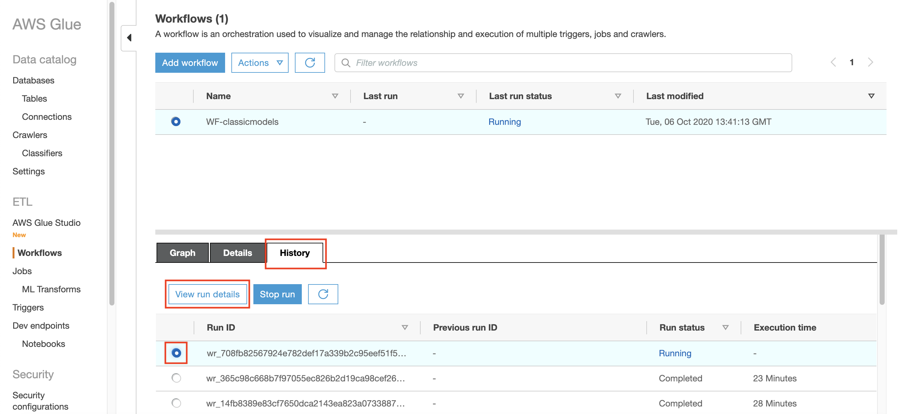

## Run Incremental Data Lake Snapshot

Once the data has been replicated through your RDS MySQL, we are going to manually run the blueprint from lake formation.

From previous lab in `Integrate Database to Data Lake`, we have created blueprint to run by schedule. We can also manually run the job as well.

1. go to [Lake Formation Console](https://console.aws.amazon.com/lakeformation/home?region=us-east-1#firstRun)
2. click `Blueprints` at the left menu
3. click the name of your blueprint (`WF-classicmodels`)
    
4. click `Start`
    

Once you click start, it will take around 20 minutes to run the blueprint.

During running, we can check the steps

5. click `View graph`
    

it will open the new tab in glue console

6. click `History` tab
7. click the radio button of running id
8. click `View run details`
    

it will display the steps on which part of the flow that is currently being executed.
    

If it's done, it will display the run_state as `COMPLETED`
    

[BACK TO WORKSHOP GUIDE](../../README.md)