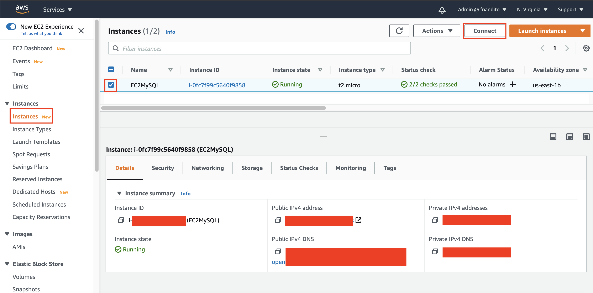
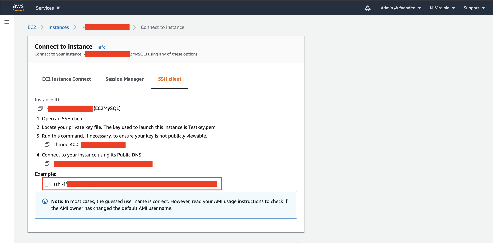
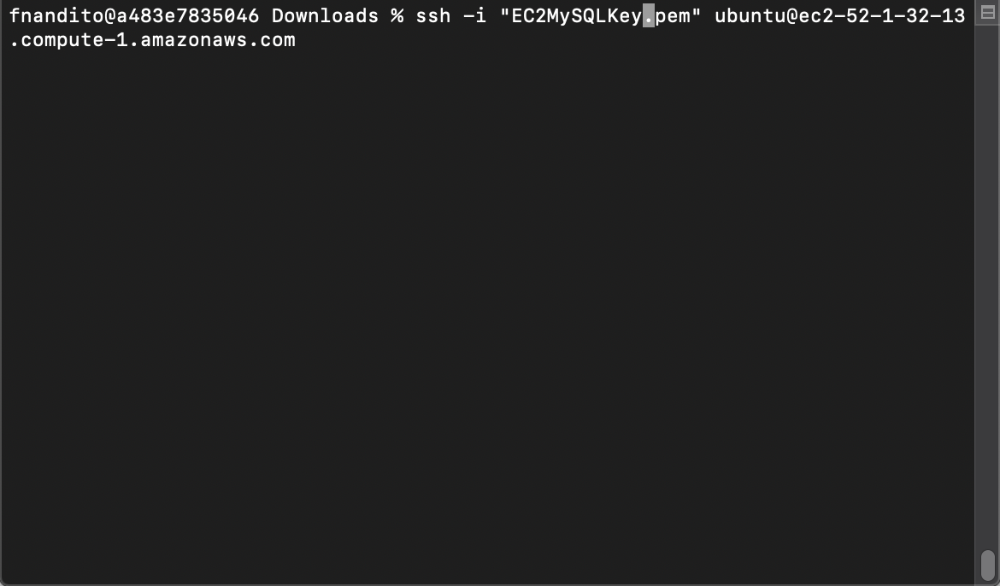
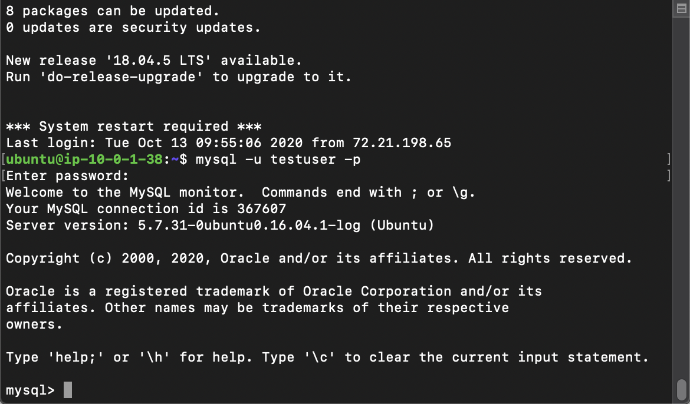
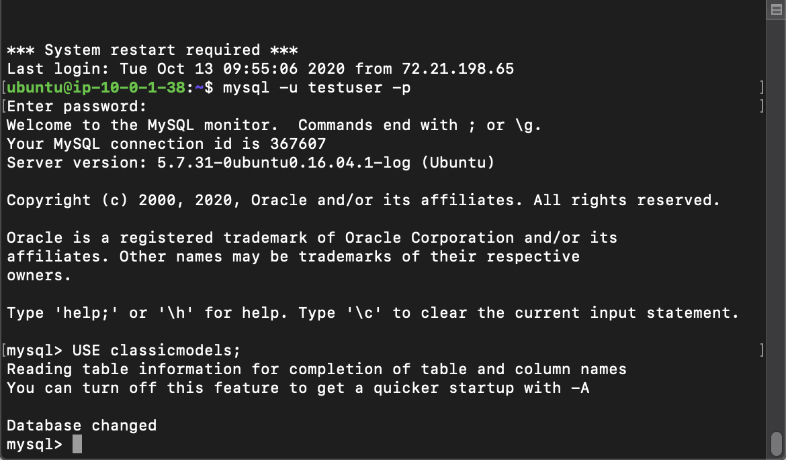
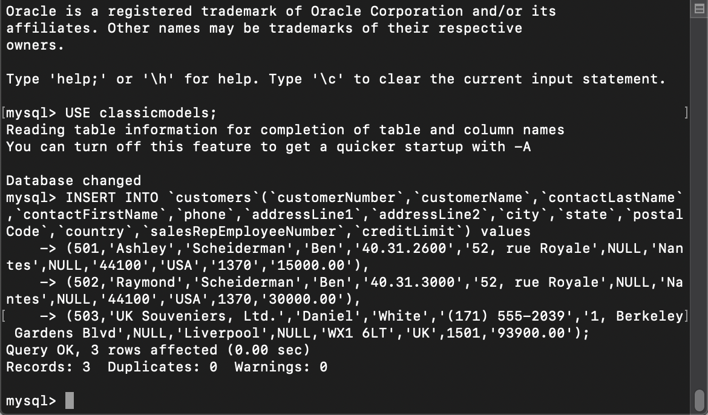
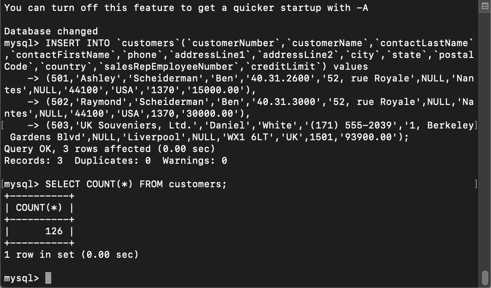
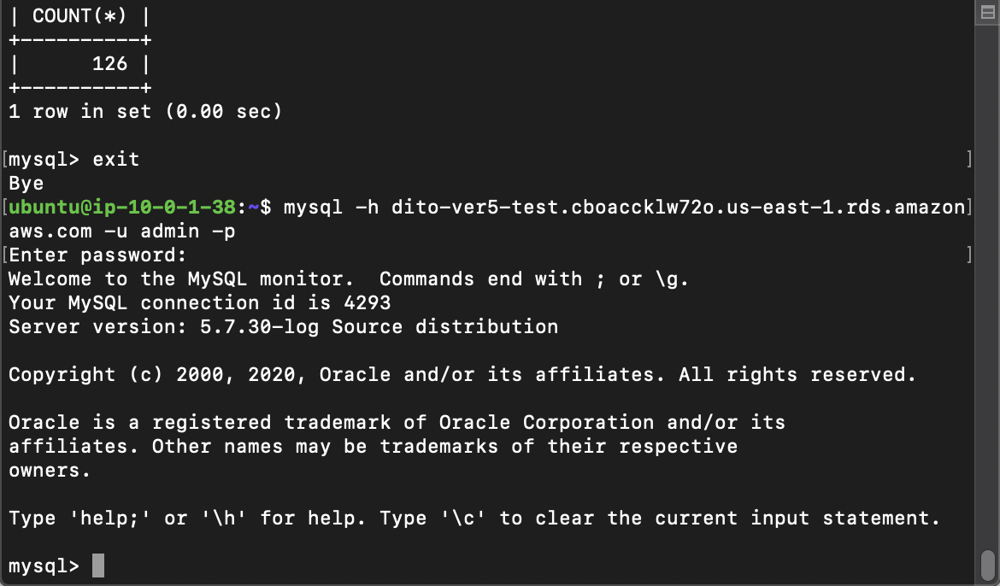
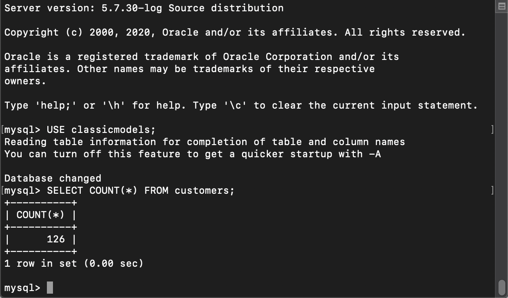

## Insert EC2 database a new row

Now, we are going to check the data processing from the EC2 to RDS MySQL that we have done previously.

1. go to [EC2 Console](https://console.aws.amazon.com/ec2/v2/home?region=us-east-1#Home:)
2. click `Instances` at the left menu
3. click the checkbox at the left side of your instance (`EC2MySQL`)
4. click `connect`
    
5. copy the SSH instruction (the one stated like `ssh -i EC2MySQLKey.pen ubuntu@ec2-...)
    
6. open a new terminal and go to the directory where you save your key (`EC2MySQLKey`)
7. paste the SSH instruction and run the code to connect to your instance
    

Now, you will be connected to your instance.

8. in terminal, type `mysql -u testuser -p`
9. input your password
    

it will show MySQL interface

10. in MySQL, type `USE classicmodels;` and enter
    
11. copy this query below
```
INSERT INTO `customers`(`customerNumber`,`customerName`,`contactLastName`,`contactFirstName`,`phone`,`addressLine1`,`addressLine2`,`city`,`state`,`postalCode`,`country`,`salesRepEmployeeNumber`,`creditLimit`) values 
(501,'Ashley','Scheiderman','Ben','40.31.2600','52, rue Royale',NULL,'Nantes',NULL,'44100','USA','1370','15000.00'),
(502,'Raymond','Scheiderman','Ben','40.31.3000','52, rue Royale',NULL,'Nantes',NULL,'44100','USA',1370,'30000.00'),
(503,'UK Souveniers, Ltd.','Daniel','White','(171) 555-2039','1, Berkeley Gardens Blvd',NULL,'Liverpool',NULL,'WX1 6LT','UK',1501,'93900.00');
```
12. paste it to your MySQL interface and enter
    

We need to check the total rows existed in customers table.

13. in MySQL, type `SELECT COUNT(*) FROM customers;` and enter
    

it will show 126 rows of data.

Now, we are going to check our RDS if it's replicating the same rows of data.

14. type `exit`. It will back to ubuntu terminal

Since the EC2 instance also acts as a bastion host, we can access RDS database by using the ubuntu instance.

15. Leave and don't close your ubuntu terminal.
16. go to [RDS Console](https://console.aws.amazon.com/rds/home?region=us-east-1)
17. click `Databases` at the left menu
18. click `RDSMySQL` name at your database
19. copy the endpoint link that is displayed at `Connectivity & security` tab
20. go back to your terminal and type `mysql -h your-endpoint-here -P 3306 -u admin -p`
21. type your password
    

it will display the MySQL interface from your RDS

23. in RDS MySQL, type `USE classicmodels;` and enter
24. in RDS MySQL, type `SELECT COUNT(*) FROM customers;` and enter
    

you will see that the database will replicate and display the same result (126)

[BACK TO WORKSHOP GUIDE](../../README.md)