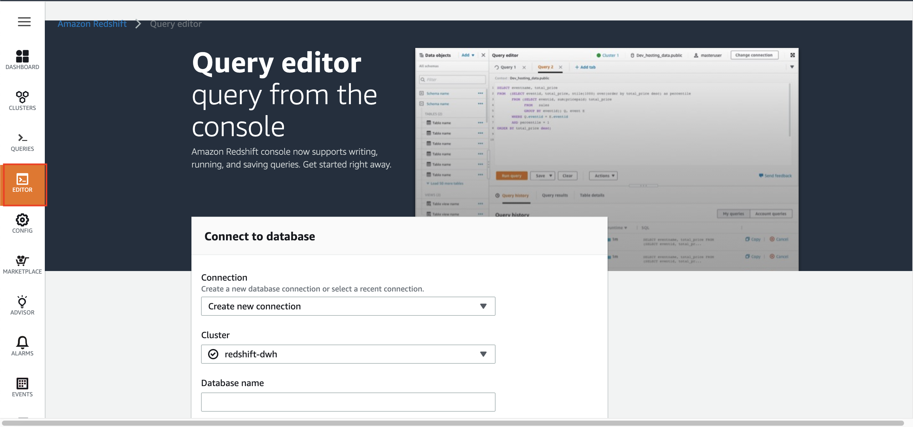
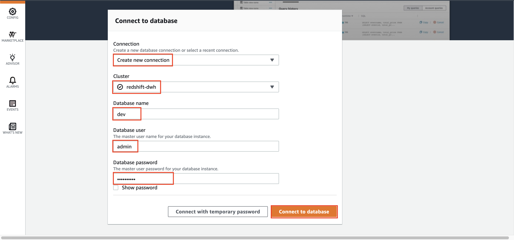
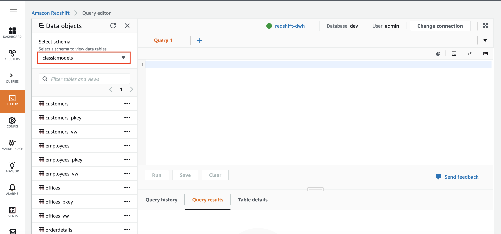
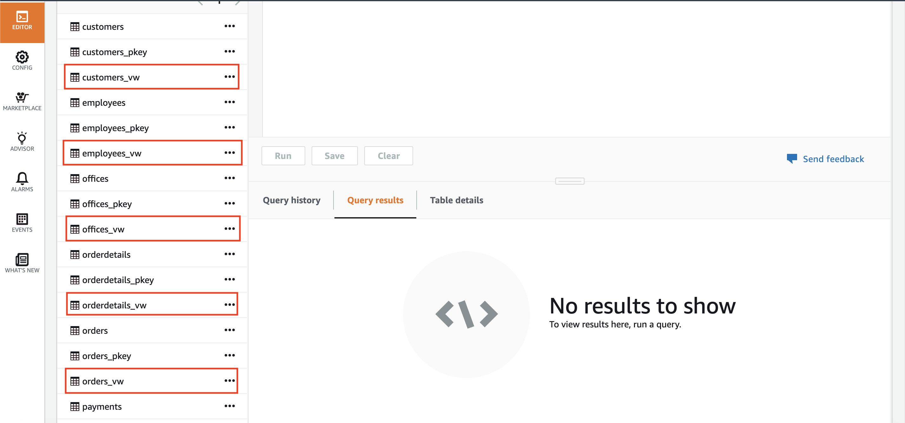
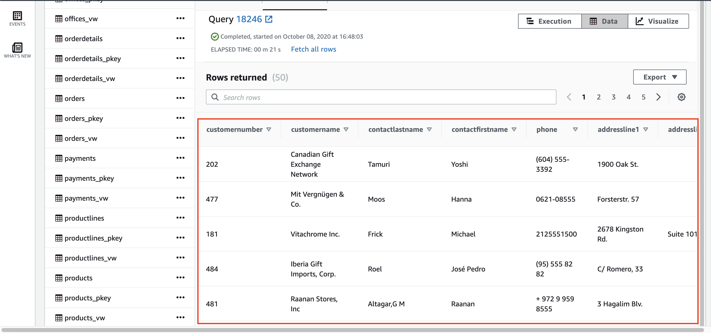

## Create View table for data visualization

In this step, we need to create view table to be accessed by the data visualization tool (Quicksight) for later use.
1. go to [Redshift Console](https://console.aws.amazon.com/redshiftv2/home?region=us-east-1#dashboard)
2. click `Editor` at the left menu
    

usually, if you have logged in in not a long time, it will re-login automatically. But, if you have logged out, you need to login again.

3. in connection, choose `Create new connection`
4. in cluster, choose `redshift-dwh`
5. in database name, type `dev`
6. in database user, type `admin`
7. in database password, type your password.
8. click `Connect to database`
    
9. check if the schema is `classicmodels`
    
10. [Download this file](../../files/Visualization/ViewTable/RedshiftView.sql) and execute each of the query separately per view.

Once you execute each of the view query, it will appear at your tables and views list
    

let's test one of the view.

11. in Redshift query editor, type this query
```
    SELECT * FROM classicmodels.customers_vw
```

it will display the query result as below
    

[BACK TO WORKSHOP GUIDE](../../README.md)