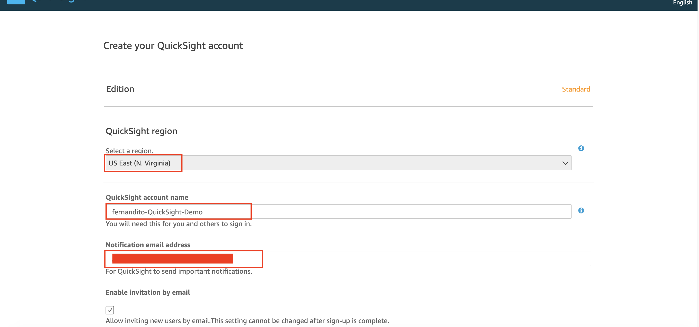
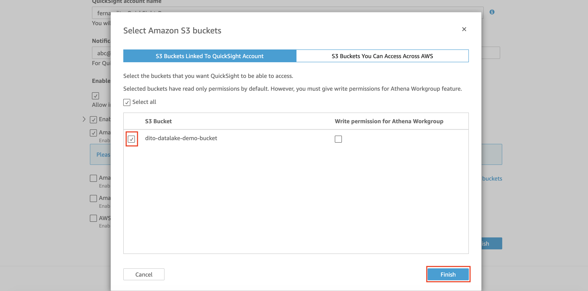
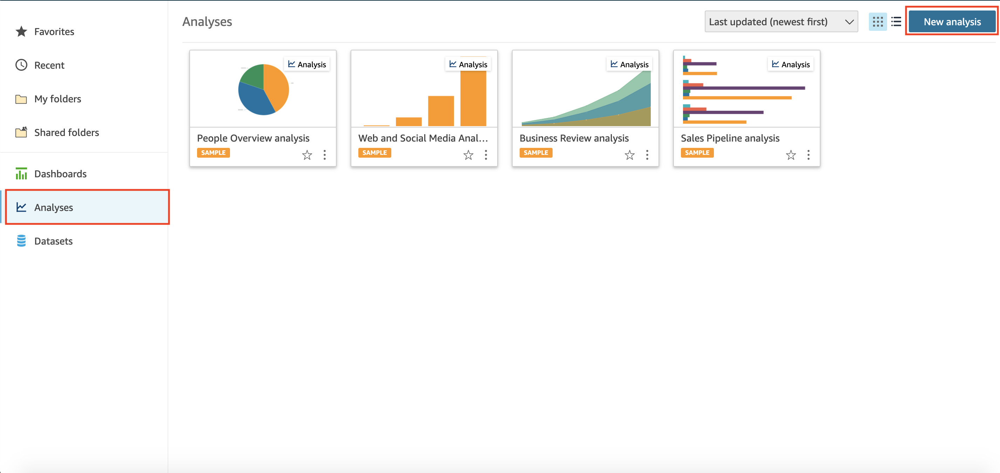
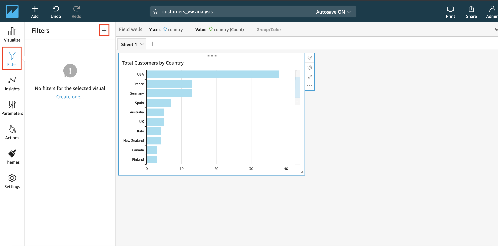
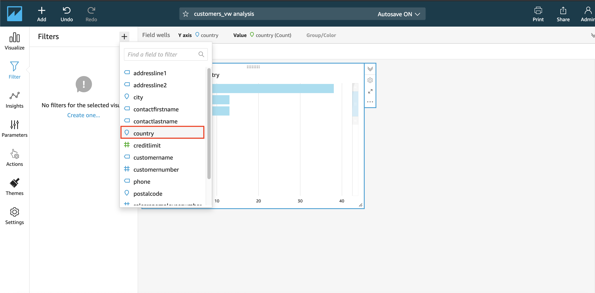

## Visual Data from Data Warehouse using BI Tools (QuickSight)

1. Go to [AWS Console](https://console.aws.amazon.com/console/home?region=us-east-1#)
2. Type `QuickSight` and click the QuickSight menu
    
3. click `Sign up for QuickSight`
    
4. in option, choose `Standard`
5. click `continue`
6. in region, choose `US East (N. Virginia)`
7. in QuickSight account name, fill it with `yourname-QuickSight-Demo`
8. fill your email address
    
9. click `Amazon S3` checkbox
    
10. select your s3 bucket `yourname-datalake-demo-bucket`
11. click `finish`
    
12. click `Finish` at the registration page
    

It will take a few minutes to setup your account. once it's ready, it will display this page below

13. click `Go to Amazon QuickSight`

Now, we need to setup the connection from redshift to quicksight so it will allow the connection between redshift and quicksight.

14. go to [VPC Console](https://console.aws.amazon.com/console/home?region=us-east-1)
15. click `Security group` at the left menu
16. click `Create security group`
    
17. in security group name, type `Amazon-QuickSight-SG`
18. in description, fill it as `Security group for QuickSight`
19. in VPC, choose your default VPC
    
20. in inbound rules click `Add Rule`
21. in type, choose `Redshift`
22. for source, you need to find the IP at [this link](https://docs.aws.amazon.com/quicksight/latest/user/regions.html) and use based on your current region. Since the current workshop is using North Virginia (us-east-1) region, type the source as `52.23.63.224/27`. if you use different region, please check the link.
23. click `Add Rule`
24. in type, choose `All TCP`
25. in source, type `default` and choose your default security group
    
26. click `Create security group` at the bottom page

Now, we need to modify the security group of your redshift.

27. go to [Redshift Console](https://console.aws.amazon.com/redshiftv2/home?region=us-east-1#dashboard)
28. click `Clusters` at the left menu
29. click your cluster name `redshift-dwh`
    
30. click `Properties` tab
    
31. in Network and security, click `edit`
    
32. append the `Network and security` section
33. in VPC security groups, type `Amazon-QuickSight-SG` and click it
    

there will be 2 Security groups attach to your data warehouse, the `Amazon-QuickSight-SG` and your default security group.

34. click `Modify cluster`

Then, we need to enable our data warehouse to be publicly available.

35. in your data warehouse page, click `Actions` and click `Modify publicly accessible setting`
    
36. in publicly accessible page, click `Yes`
37. leave the Elastic IP address as `None`
38. click `Confirm`
    

It might take a few minutes to change the settings. your data warehouse will be in `Modifying` state
    

once it's done, it will be in `Available` state.
    

Now, your data warehouse can access the quicksight.

39. go to [QuickSight Console](https://us-east-1.quicksight.aws.amazon.com/sn/start)
40. in analyses on left menu, click `New Analysis`
    
41. in data sets, click `New dataset`
    
42. in data sets options, choose `Redshift Auto-discovered`
    
43. in data source name, type `classicmodels_customers_vw`
44. in instance ID, choose `redshift-dwh`
45. in connection type, choose `Public network`
46. in database name, type `dev`
47. in username, type `admin`
48. in password, type your data warehouse user password
49. click `Validate connection`
    

it might take few seconds until a minute to validate the connection.

Once it's done, it will change to `Validated`.
    

50. click `Create data source`
51. in schema, choose `classicmodels`
52. in tables, choose `customers_vw`
53. click `Select`
    
54. in data set creation, choose `Import to SPICE for quicker analytics`

SPICE is a Simple, Paralel, In-Memory Calculated Engine. It will acts as a cache for your data so the dashboard you will create won't need to retrieve it directly to your data warehouse all the time.

55. click `Visualize`
    

Now, we will be able to create a dashboard based on the data we have chosen.

56. in field list, click `country`
    
57. click `Field wells` and drag the country from the field list to value
    

it will dsiplay the total of customers based on the country.

We are going to change the title of the visual.

58. click the title
    
59. delete the title and type `Total Customers by Country`
    

Now, we are going to try to filter the visual.

60. click `Filter` at the left menu
    
61. click `+` sign at the top and choose `Country`
    
62. click the country filter
    
63. in country filter, deselect the checkbox `Select all`
    
64. select `Portugal`, `UK`, and `USA`
65. click `Apply`
    

the visual will change.
    

Now, we need to schedule a refresh dataset to keep update the data.

66. click quicksight logo at the top left
    

67. click `Datasets` at the left menu
68. click `customers_vw` datasets
    
69. in data sets descriptions, click `Schedule refresh`
    
70. in Schedule refresh page, click `Create`
    
71. in schedule, ensure that the date is by tomorrow's date
72. in time, change it to 3:00 AM
73. click `Create`
    
74. once it's done, click `Cancel` or click the `X` button at the top
    
75. click `X` again at the data sets description page
    

[BACK TO WORKSHOP GUIDE](../../README.md)